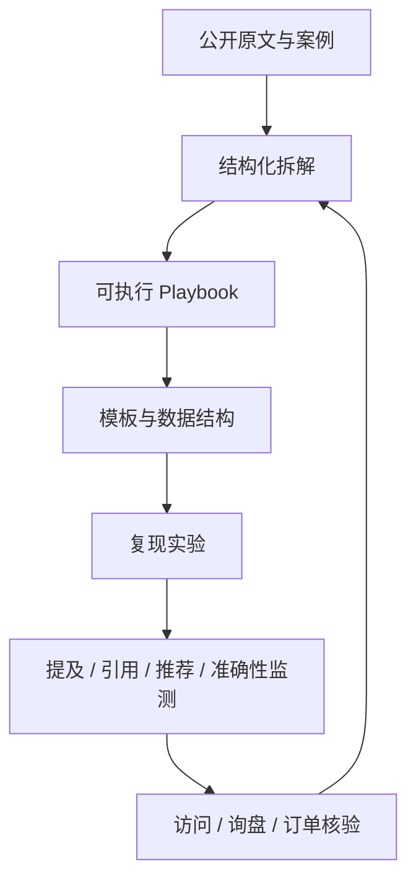

# GEO-Master

> 中国品牌出海与国内 AI GEO 实战案例库、SOP、信源索引、模板和复现实验。

[](https://github.com/ChinaYiqun/GEO-Master/stargazers)
[](LICENSE)
[](CHANGELOG.md)
[](cases/README.md)
[](templates/README.md)

GEO-Master 研究品牌如何被 ChatGPT、Perplexity、Gemini、Claude、Google AI Search、豆包、DeepSeek、腾讯元宝等生成式平台**发现、理解、提及、引用与推荐**。

这里不堆砌空泛概念，也不把服务商截图直接当成成功证据。核心路径是：

**真实业务问题 → 原文与案例 → 具体实施 → 技术解释 → 数据验证 → 可复用模板 → 失败复盘**

## 30 分钟快速开始

第一次使用，直接复制下面三个文件：

1. [AI 可见性基线测试 Playbook](playbooks/ai-visibility-baseline.md)
2. [30 条中英文基线问题集 CSV](templates/baseline-query-set.csv)
3. [每周 GEO 监测表 CSV](templates/weekly-monitoring.csv)

最小测试：

```text
选择 10 个问题
× 2 个 AI 平台
× 每题运行 1–3 次
→ 记录品牌提及、官网引用、推荐位置和事实准确性
```

不要在没有基线的情况下直接宣布“GEO 提升了 67%”或“带来 136 单”。

## 项目地图



## 为什么做这个项目

现有 GEO 项目大多偏向通用教程、学术论文或自动化工具。GEO-Master 的重点是：

- 同时覆盖中国品牌出海和国内 AI 搜索生态；
- 用 CASE 驱动，而不是先讲一整本技术教科书；
- 保留公众号、作者个人站和官方文档的原始入口；
- 同时记录成功案例、失败案例和无法验证的营销宣称；
- 提供可以直接复制的 SOP、Prompt、YAML、CSV、监测表和数据 Schema；
- 逐步公开自有复现实验和长期数据；
- 允许社区公开提交纠错和证据补充。

## 从这里开始

### 按需求进入

- [新读者入口：我应该先看什么？](START-HERE.md)
- [案例库](cases/README.md)
- [执行 Playbook](playbooks/README.md)
- [技术解释](explainers/README.md)
- [模板与可下载资产](templates/README.md)
- [实验数据规范](data/README.md)

### 信源与规范

- [第三方运营案例索引](cases/third-party-operations/CASE-INDEX.md)
- [国内 GEO 原文与信源索引](references/DOMESTIC-GEO-SOURCES.md)
- [第三方 GEO 运营案例与公众号观察](cases/third-party-operations/README.md)
- [案例模板](CASE-TEMPLATE.md)
- [证据与案例评级标准](EVIDENCE-STANDARD.md)
- [贡献指南](CONTRIBUTING.md)
- [90 天路线](ROADMAP.md)
- [更新记录](CHANGELOG.md)

## 当前重点内容

| 内容 | 场景 | 你能拿走什么 | 状态 |
|---|---|---|---|
| [AI 可见性基线测试](playbooks/ai-visibility-baseline.md) | 全平台 | 问题集、运行规则、指标和 30 分钟最小方案 | 已发布 |
| [品牌提及、引用和推荐的区别](explainers/mentions-vs-citations.md) | 指标口径 | 避免把不同结果混成一个“GEO 排名” | 已发布 |
| [实验室仪器 Reddit GEO：“136 单”案例](cases/b2b-industrial/case-001-lab-instrument-reddit/README.md) | B2B 外贸 | Reddit + Perplexity + Ahrefs 链路及归因核查 | 已发布初版 |
| [Ahrefs：用 Reddit 反向挖掘真实需求](cases/third-party-operations/cases/TP-002-ahrefs-reddit-demand-research/README.md) | 需求研究 | 从社区问题到官网选题的 SOP | 已发布 |
| [Ahrefs Brand Radar 监测工作流](cases/third-party-operations/cases/TP-003-ahrefs-brand-radar-monitoring/README.md) | AI 可见性 | 提及、引用、推荐与准确率监测 | 已发布 |
| [老钱聊GEO：AI 友好官网结构拆解](cases/third-party-operations/cases/TP-005-laoqian-ai-friendly-website/README.md) | 国内官网 | 5 页面改造、页面模板和 30 天实验 | 已发布 |
| [招财兔 GEO：品牌事实库实施版](cases/third-party-operations/cases/TP-006-lijinlong-brand-fact-base/README.md) | 国内 GEO | 品牌事实结构、声明来源表和审核流程 | 已发布 |
| [国内 GEO 执行手册](playbooks/DOMESTIC-GEO-PLAYBOOK.md) | 国内全平台 | 30 天落地计划、平台分工和诊断流程 | 已发布 |

> 所有结果数字都会标记为“已验证”“可复现”“案例方宣称”或“无法验证”。

## 可直接使用的资产

### 基线与监测

- [`baseline-query-set.csv`](templates/baseline-query-set.csv)：30 条中英文问题；
- [`weekly-monitoring.csv`](templates/weekly-monitoring.csv)：逐次运行记录；
- [`engine-run.schema.json`](schemas/engine-run.schema.json)：机器可读运行 Schema；
- [`engine-run.example.json`](data/examples/engine-run.example.json)：标准示例数据。

### 案例与贡献

- [`CASE-TEMPLATE.md`](CASE-TEMPLATE.md)：完整案例包；
- [`CASE-SUMMARY-TEMPLATE.md`](cases/third-party-operations/CASE-SUMMARY-TEMPLATE.md)：第三方文章快速拆解；
- GitHub Issue Forms：提交案例、补充信源、公开纠错；
- Pull Request 模板：证据、复现、版权和合规自检。

## 国内 GEO 原文如何进入仓库

我们不会无脑复制公众号文章，而是分成三层：

```text
references/     原文标题、日期、作者和稳定链接
cases/          对高信息密度文章做证据化拆解
playbooks/      跨多篇文章提炼出的执行系统
```

例如：

- “老钱聊GEO”的官网结构文章，被转化为页面改造 SOP 和对照实验；
- “招财兔 GEO”的品牌事实库文章，被补成数据结构和版本审核流程；
- 李金龙第 72–100 篇，不按编号机械堆放，而是重组为团队治理、监测诊断、内容转化和长期资产四条主线。

查看：[国内 GEO 原文与信源索引](references/DOMESTIC-GEO-SOURCES.md)

## 每个 CASE 包含什么

```text
case-xxx-name/
├── README.md              # 30 秒摘要与完整故事
├── implementation.md      # 实施步骤、人员、周期和工具
├── mechanism.md           # 为什么可能有效
├── verification.md        # 数据、证据和归因核查
├── replication-plan.md    # 如何复现实验
└── assets/                # Prompt、问题库、监测表和内容模板
```

部分轻量案例会先以单文件形式发布，获得更多原始数据后再扩展为完整案例包。

## 四个指标必须分开

```text
AI 是否提到你
AI 是否引用你
AI 是否推荐你
AI 是否说对你
```

商业结果再单独追踪：

```text
用户是否点击或搜索品牌
→ 是否访问官网
→ 是否形成询盘
→ 是否成交
```

完整解释：[品牌提及、来源引用和明确推荐有什么区别](explainers/mentions-vs-citations.md)

## 我们不会做什么

- 不把一次 ChatGPT、豆包或 DeepSeek 回答当成稳定结论；
- 不把 Ahrefs 外链数据等同于 AI 推荐；
- 不伪装普通用户发布品牌营销内容；
- 不建议批量生成低价值社区回复或城市替换页；
- 不保证“修改几个标签就能被大模型收录”；
- 不替无法独立验证的订单数字背书；
- 不把公众号作者的经验表达包装成平台官方规则；
- 不用单一总分掩盖负面提及和事实错误。

## 贡献方式

欢迎提交：

- 可核验的 GEO 案例；
- 失败案例与踩坑记录；
- 平台变化和复现实验；
- 工具、数据集、Prompt 与模板；
- 公众号、演讲、访谈和服务商案例线索；
- 对已有案例证据链的补充或质疑。

开始前请阅读 [CONTRIBUTING.md](CONTRIBUTING.md)。可以直接使用 Issues 中的“提交 GEO 案例”或“信源补充与纠错”表单。

## Star 与关注

仓库会持续更新真实案例、复现实验、国内外信源和可下载模板。觉得方向有价值，可以 Star 以便跟踪后续更新。

## Citation

研究、报告、培训或客户项目使用本仓库时，可以引用 [`CITATION.cff`](CITATION.cff)，并同时保留每个案例对应的原始文章与官方来源。

## License

MIT License。案例引用、截图、第三方文章和外部数据仍遵循其原始版权与使用规则。