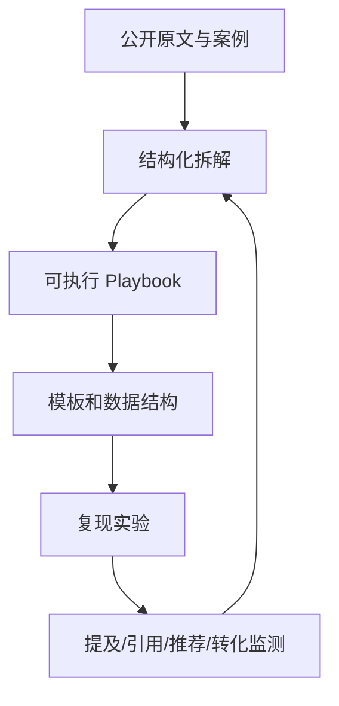

# GEO-Master

> 中国品牌出海与国内 AI GEO 实战案例库、SOP、信源索引和复现实验。

[](https://github.com/ChinaYiqun/GEO-Master/stargazers)
[](LICENSE)
[](cases/third-party-operations/CASE-INDEX.md)
[](references/DOMESTIC-GEO-SOURCES.md)

GEO-Master 研究品牌如何被 ChatGPT、Perplexity、Gemini、Claude、Google AI Search、豆包、DeepSeek、腾讯元宝等生成式平台**发现、理解、引用与推荐**。

这里不堆砌空泛概念，也不把服务商截图直接当成成功证据。每个主题尽量按照以下结构展开：

**真实业务问题 → 原文与案例 → 具体实施 → 技术解释 → 数据验证 → 可复用模板 → 失败复盘**

## 项目地图



## 为什么做这个项目

现有 GEO 项目大多偏向通用教程、学术论文或自动化工具。GEO-Master 的重点是：

- 同时覆盖中国品牌出海和国内 AI 搜索生态；
- 用 CASE 驱动，而不是先讲一整本技术教科书；
- 保留公众号、作者个人站和官方文档的原始入口；
- 同时记录成功案例、失败案例和无法验证的营销宣称；
- 提供可以直接复制的 SOP、Prompt、YAML、CSV、监测表和内容模板；
- 逐步公开自有复现实验和长期数据。

## 从这里开始

### 快速阅读

- [新读者入口：我应该先看什么？](START-HERE.md)
- [第三方运营案例索引](cases/third-party-operations/CASE-INDEX.md)
- [国内 GEO 原文与信源索引](references/DOMESTIC-GEO-SOURCES.md)
- [国内 GEO 执行手册](playbooks/DOMESTIC-GEO-PLAYBOOK.md)

### 项目规范

- [第三方 GEO 运营案例与公众号观察](cases/third-party-operations/README.md)
- [案例模板](CASE-TEMPLATE.md)
- [第三方运营案例简版模板](cases/third-party-operations/CASE-SUMMARY-TEMPLATE.md)
- [证据与案例评级标准](EVIDENCE-STANDARD.md)
- [90 天迭代路线](ROADMAP.md)
- [参与贡献](CONTRIBUTING.md)

## 当前重点内容

| 内容 | 场景 | 你能拿走什么 | 状态 |
|---|---|---|---|
| [实验室仪器 Reddit GEO：“136 单”案例](cases/b2b-industrial/case-001-lab-instrument-reddit/README.md) | B2B 外贸 | Reddit + Perplexity + Ahrefs 完整链路及归因核查 | 已发布初版 |
| [Ahrefs：用 Reddit 反向挖掘真实需求](cases/third-party-operations/cases/TP-002-ahrefs-reddit-demand-research/README.md) | 需求研究 | 从社区问题到官网选题的 SOP | 已发布 |
| [Ahrefs Brand Radar 监测工作流](cases/third-party-operations/cases/TP-003-ahrefs-brand-radar-monitoring/README.md) | AI 可见性 | 提及、引用、推荐与准确率监测 | 已发布 |
| [老钱聊GEO：AI 友好官网结构拆解](cases/third-party-operations/cases/TP-005-laoqian-ai-friendly-website/README.md) | 国内官网 | 5 页面改造、页面模板和 30 天实验 | 已发布 |
| [招财兔 GEO：品牌事实库实施版](cases/third-party-operations/cases/TP-006-lijinlong-brand-fact-base/README.md) | 国内 GEO | `brand-facts.yaml`、声明来源表和审核流程 | 已发布 |
| [国内 GEO 执行手册](playbooks/DOMESTIC-GEO-PLAYBOOK.md) | 国内全平台 | 30 天落地计划、平台分工和诊断流程 | 已发布 |

> 所有结果数字都会标记为“已验证”“可复现”“案例方宣称”或“无法验证”。

## 国内 GEO 原文如何进入仓库

我们不会无脑复制公众号文章，而是分成三层：

```text
references/     原文标题、日期、作者和稳定链接
cases/          对高信息密度文章做证据化拆解
playbooks/      跨多篇文章提炼出的执行系统
```

例如：

- “老钱聊GEO”的官网结构文章，被转化为页面改造 SOP 和对照实验；
- “招财兔 GEO”的品牌事实库文章，被补成 YAML/CSV 数据结构和版本审核流程；
- 李金龙第 72–100 篇，不按编号机械堆放，而是重组为团队治理、监测诊断、内容转化和长期资产四条主线。

查看：[国内 GEO 原文与信源索引](references/DOMESTIC-GEO-SOURCES.md)

## 每个 CASE 包含什么

一个完整 CASE 不只是一篇文章，而是一组可以直接执行的材料：

```text
case-xxx-name/
├── README.md              # 30 秒摘要与完整故事
├── implementation.md      # 实施步骤、人员、周期和工具
├── mechanism.md           # 为什么可能有效
├── verification.md        # 数据、证据和归因核查
├── replication-plan.md    # 如何复现实验
└── assets/                # Prompt、问题库、监测表和内容模板
```

部分轻量案例会先以单文件形式发布，后续获得更多原始数据再扩展为完整案例包。

## 核心内容地图

### 1. CASE：先看别人到底做了什么

- B2B 工业品如何从采购问题切入；
- 消费电子如何进入 AI 对比与推荐答案；
- Reddit、YouTube、Quora、LinkedIn 与官网如何协同；
- 国内官网、公众号、知乎、百家号和短视频如何分工；
- AI 提及率提高但没有询盘时，问题出在哪里；
- 服务商“成功案例”中的数据是否经得起验证。

### 2. Playbook：拿去就能执行

- GEO 基线测试；
- Reddit 社区参与；
- 产品页与对比页改造；
- 品牌事实库；
- 国内多平台内容矩阵；
- AI 引用监测；
- GEO 询盘与订单归因。

### 3. Explainers：只讲案例需要的技术

- 为什么被搜索引擎收录不等于会被 AI 引用；
- Query Fan-out 如何改变关键词研究；
- Passage Retrieval 为什么更关注段落而非整页；
- 品牌提及、官网引用和进入推荐列表有什么区别；
- 抓取、索引、召回、重排、生成与引用选择的完整链路。

### 4. Templates：减少重复劳动

- CASE 收集表；
- 采购问题库；
- AI 可见性基线问题集；
- 每周监测表；
- Reddit 回复检查清单；
- 内容 Brief；
- 询盘和订单归因表；
- 品牌事实库 YAML / 声明来源 CSV。

## 我们不会做什么

- 不把一次 ChatGPT、豆包或 DeepSeek 回答当成稳定结论；
- 不把 Ahrefs 外链数据等同于 AI 推荐；
- 不伪装普通用户发布品牌营销内容；
- 不建议批量生成低价值社区回复或城市替换页；
- 不保证“修改几个标签就能被大模型收录”；
- 不替无法独立验证的订单数字背书；
- 不把公众号作者的经验表达包装成平台官方规则。

## 贡献方式

欢迎提交：

- 可核验的 GEO 案例；
- 失败案例与踩坑记录；
- 平台变化和复现实验；
- 工具、数据集、Prompt 与模板；
- 公众号、演讲、访谈和服务商案例线索；
- 对已有案例证据链的补充或质疑。

开始前请阅读 [CONTRIBUTING.md](CONTRIBUTING.md)。

## Star 与关注

这个仓库会持续更新真实案例、复现实验、国内外信源和可下载模板。觉得方向有价值，可以 Star 以便跟踪后续更新。

## License

MIT License。案例引用、截图和第三方材料仍遵循其原始版权与使用规则。