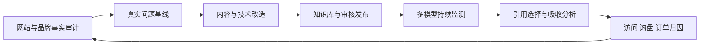

# GEO-Master

> 面向中国品牌出海与国内 AI 搜索的 GEO 实战开源项目：网站审计、真实案例、可复现实验、Agent Skills、监测模板、数据规范与工具集成。

[](https://github.com/ChinaYiqun/GEO-Master/stargazers)
[](LICENSE)
[](CHANGELOG.md)

**自己研究和复现：** 使用本仓库的案例、模板、数据结构和 Skill。  
**希望用于真实企业业务：** [查看 GEO 产品化方案](https://tst.ahupo.cn/intro?utm_source=github&utm_medium=repository&utm_campaign=geo-master&utm_content=readme-top)

GEO-Master 研究品牌如何在 ChatGPT、Perplexity、Gemini、Claude、Google AI Search、豆包、DeepSeek、腾讯元宝等生成式平台中：

```text
被发现 → 被理解 → 被提及 → 被引用 → 被推荐 → 带来访问与询盘
```

项目不把一次 AI 回答当成稳定排名，也不把爬虫可访问、Schema、`llms.txt`、外链数量或服务商截图直接写成 GEO 成功。

---

## 现在能做什么

| 能力 | 说明 | 入口 |
|---|---|---|
| 网站 GEO 审计 | 检查爬虫、页面内容、品牌事实、Schema、旧信息与可引用性 | [`geo-master` Skill](.agents/skills/geo-master/SKILL.md) |
| AI 可见性基线 | 用真实问题记录品牌提及、官网引用、推荐位置和准确性 | [基线测试 Playbook](playbooks/ai-visibility-baseline.md) |
| 引用实验 | 研究引用选择、内容吸收、实体曝光和 Web/App 差异 | [`geo-master-citation-lab` Skill](.agents/skills/geo-master-citation-lab/SKILL.md) |
| 多模型监测 | 跟踪品牌、竞品、引用、地域差异、趋势和漂移告警 | [`geo-master-monitor` Skill](.agents/skills/geo-master-monitor/SKILL.md) |
| 内容工程 | 从事实库、问题地图到生成、审核、发布和多站分发 | [工具生态与集成](integrations/README.md) |
| 案例与证据 | 拆解国内外 GEO 案例，区分宣称、观察和可验证结果 | [案例库](cases/README.md) |
| 模板与数据 | 品牌事实库、问题集、监测表、内容 Brief、归因表和 Schema | [模板资产](templates/README.md) |

完整架构：**[GEO-Master 工具生态与集成路线](integrations/README.md)**

---

## 30 分钟建立第一版基线

第一次使用，先复制三个文件：

1. [AI 可见性基线测试 Playbook](playbooks/ai-visibility-baseline.md)
2. [30 条中英文基线问题集](templates/baseline-query-set.csv)
3. [每周 GEO 监测表](templates/weekly-monitoring.csv)

最小实验：

```text
10 个真实用户问题
× 2 个 AI 平台
× 每题运行 1–3 次
→ 记录提及、引用、推荐和事实准确性
```

没有基线、原始回答、运行环境和重复测试记录时，不应宣布“GEO 提升了多少”或“带来了多少订单”。

---

## 三个 Agent Skills

仓库在 `.agents/skills/` 中提供三个互补入口。

### `geo-master`

负责：

- 网站快速诊断和完整审计；
- 品牌事实与来源治理；
- 问题基线和内容规划；
- GEOFlow 式内容生产、审核和分发设计；
- 优化前后验证。

### `geo-master-citation-lab`

负责：

- 受控 Prompt 实验；
- 引用选择与引用吸收；
- 品牌和产品实体曝光；
- 平台、地区、语言、Web/App 差异；
- 外部研究数据的许可合规导入。

### `geo-master-monitor`

负责：

- 多模型并行监测；
- 品牌与竞品 Share of Voice；
- 引用域名和页面机会；
- 地区差异和历史变化；
- 漂移告警、周报和月报；
- 对接 Elmo、GEO/AEO Tracker 等自托管系统。

---

## 完整工作链


```mermaid
flowchart LR
    A[网站与品牌事实审计] --> B[真实问题基线]
    B --> C[内容与技术改造]
    C --> D[知识库与审核发布]
    D --> E[多模型持续监测]
    E --> F[引用选择与吸收分析]
    F --> G[访问 询盘 订单归因]
    G --> A
```

各层职责：

```text
GEO-Master
  标准、案例、模板、审计、实验、监测契约和证据边界

外部工具
  内容生产、多站分发、多模型执行、看板和数据采集

企业产品
  部署、实施、长期运营、报告和支持
```

需要企业落地服务，可以查看：**[GEO 产品介绍](https://tst.ahupo.cn/intro?utm_source=github&utm_medium=repository&utm_campaign=geo-master&utm_content=workflow)**

---

## 已吸收的开源能力

GEO-Master 采用“吸收能力与架构、保留上游独立部署”的方式扩展：

| 上游项目 | 吸收的能力 |
|---|---|
| `zubair-trabzada/geo-seo-claude` | GEO/SEO 审计路由、爬虫检查、结构化数据和报告工作流 |
| `yaojingang/GEOFlow` | 知识库、RAG、任务、审核、发布和多站点分发链路 |
| `yaojingang/geo-citation-lab` | 引用选择、内容吸收、实体曝光和中文生成式搜索实证研究 |
| `elmohq/elmo` | 自托管 Prompt 运行、品牌/竞品监测、引用和周期报告 |
| `danishashko/geo-aeo-tracker` | 多模型并行、地域监测、引用机会、历史对比和漂移告警 |

许可证、数据边界和具体适配方式见：[工具生态与集成架构](integrations/README.md)。

当前没有把这些项目整仓复制进来，也没有复制大型数据集、论文 PDF 或大段上游代码。后续如果引入实质代码，将保留版权、许可证、修改说明和 NOTICE。

---

## 内容与数据资产

### 案例和方法

- [新读者从这里开始](START-HERE.md)
- [案例库](cases/README.md)
- [执行 Playbook](playbooks/README.md)
- [技术解释](explainers/README.md)
- [GEO 学术、行业与媒体资料索引](references/GEO-READING-LIST.md)
- [证据与案例评级标准](EVIDENCE-STANDARD.md)

### 可复制模板

- [`brand-facts.yaml`](templates/brand-facts.yaml)：品牌事实库；
- [`claims-and-sources.csv`](templates/claims-and-sources.csv)：声明与来源；
- [`question-map.csv`](templates/question-map.csv)：用户问题地图；
- [`baseline-query-set.csv`](templates/baseline-query-set.csv)：基线问题集；
- [`weekly-monitoring.csv`](templates/weekly-monitoring.csv)：逐次监测；
- [`content-brief.md`](templates/content-brief.md)：内容 Brief；
- [`lead-attribution.csv`](templates/lead-attribution.csv)：询盘与订单归因；
- [`engine-run.schema.json`](schemas/engine-run.schema.json)：机器可读运行记录。

---

## 四个指标必须分开

```text
AI 是否提到品牌
AI 是否引用品牌或官网
AI 是否明确推荐品牌
AI 是否准确描述品牌事实
```

商业结果另行记录：

```text
点击或品牌搜索
→ 官网访问
→ 询盘
→ 报价
→ 订单
```

结果应标记为：

```text
verified       已通过可靠来源确认
reproduced     已在记录条件下重复复现
observed       少量观察
claimed        来源方宣称
pending        正在核验
expired        已过期
unknown        尚无证据
not_provided   来源未提供
```

---

## 仓库结构

```text
GEO-Master/
├── .agents/skills/  # 可调用 GEO Agent Skills
├── cases/           # 案例、证据核验与失败模式
├── playbooks/       # 可执行流程
├── explainers/      # 指标、机制与边界
├── integrations/    # 工具生态和适配架构
├── templates/       # CSV、YAML、Markdown 模板
├── references/      # 原始来源与阅读索引
├── data/            # 实验数据示例与目录规范
├── schemas/         # 机器可读数据结构
├── AGENTS.md        # AI Coding 工作规则
└── ROADMAP.md       # 项目路线图
```

---

## 不做什么

- 不伪装普通用户制造品牌口碑；
- 不批量生成低价值社区回复或重复页面；
- 不把启发式评分包装成平台官方排名机制；
- 不保证加入 `llms.txt` 或 Schema 就一定被收录；
- 不把服务商宣称和无法核验的订单数字写成事实；
- 不用一个总分掩盖负面提及、参数错误或平台缺失；
- 不复制超出许可证允许范围的代码、数据、论文或素材。

---

## 贡献

开始前请阅读：

- [贡献指南](CONTRIBUTING.md)
- [AI Agent 工作规则](AGENTS.md)
- [案例模板](CASE-TEMPLATE.md)
- [90 天路线图](ROADMAP.md)
- [更新记录](CHANGELOG.md)

欢迎提交真实案例、失败复盘、平台变化、数据集、Prompt、工具适配器和证据纠错。

## Citation

研究、报告、培训或客户项目使用本仓库时，可以引用 [`CITATION.cff`](CITATION.cff)，并保留各案例和上游项目对应的来源与许可说明。

## License

GEO-Master 原创代码和内容默认采用 MIT License。第三方代码、数据、报告、论文、截图和其他外部资产继续遵循各自许可证与版权规则。
