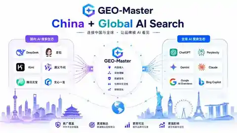
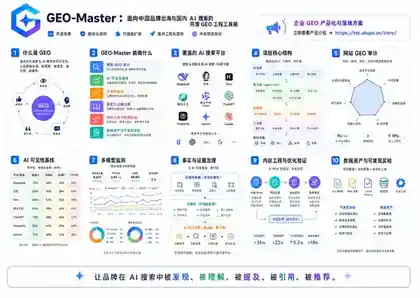
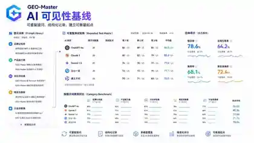
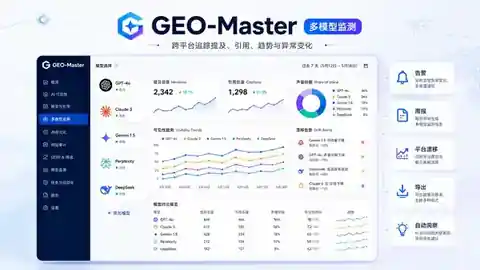
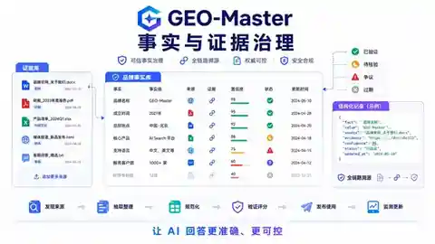
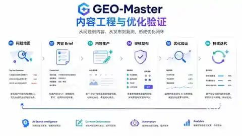
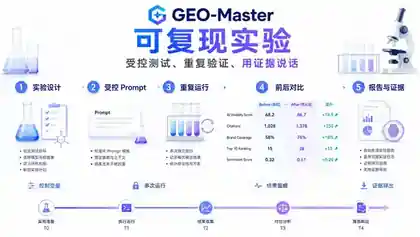
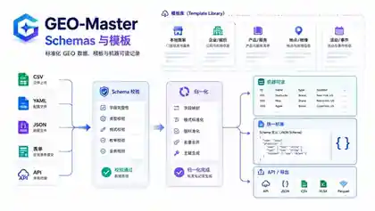

# GEO-Master｜面向中国品牌出海与国内 AI 搜索的开源 GEO Operating System

> **GEO（Generative Engine Optimization，生成式引擎优化）/ AI Search Optimization / AI Visibility**：网站审计、品牌事实、AI 可见性基线、内容工程、多站分发、多模型监测、引用实验、数据 Schema、Agent Skills 与业务归因。

**简体中文** | [English](README.en.md)

[](https://github.com/ChinaYiqun/GEO-Master/stargazers)
[](LICENSE)
[](https://github.com/ChinaYiqun/GEO-Master/actions/workflows/validate.yml)
[](CHANGELOG.md)

> [!IMPORTANT]
> **🚀 企业 GEO 产品化与落地方案**
>
> 面向真实品牌的网站审计、AI 可见性监测、内容工程与持续运营：**[立即查看产品介绍 →](https://tst.ahupo.cn/intro/)**

<p align="center">
  
</p>

GEO-Master 面向两类真实场景：

- **中国品牌出海**：ChatGPT、Perplexity、Gemini、Claude、Google AI Search 等国际生成式搜索；
- **国内 AI 搜索**：DeepSeek、豆包、腾讯元宝、Kimi、通义千问等中文 AI 平台。

<p align="center">
  
</p>

项目研究品牌如何在生成式平台中：

```text
被发现 → 被理解 → 被提及 → 被引用 → 被推荐 → 带来访问与询盘
```

它不是只讲概念的 GEO 教程，也不会把一次 AI 回答、爬虫可访问、Schema、`llms.txt`、外链数量或启发式总分直接包装成稳定排名和商业成功。

## 一张图看懂 GEO-Master

<p align="center">
  
</p>

> 图中数值、品牌和界面数据仅用于解释能力与信息结构，不代表真实客户、真实平台排名或正式 Benchmark 结果。真实结论必须来自仓库记录的基线、原始回答、证据与复测数据。

## 为什么它不是纯理论项目

| 能力声明 | 可以直接核验的仓库资产 |
|---|---|
| 网站 GEO 审计 | [`geo-master` Agent Skill](.agents/skills/geo-master/SKILL.md) + [GeoReady Adapter](scripts/geoready_audit_adapter.py) |
| AI 可见性基线测试 | [基线 Playbook](playbooks/ai-visibility-baseline.md) + [30 条中英文问题集](templates/baseline-query-set.csv) |
| 多模型监测与统一数据契约 | [`geo-master-monitor` Skill](.agents/skills/geo-master-monitor/SKILL.md) + [`monitor-run.schema.json`](schemas/monitor-run.schema.json) |
| 外部监测数据接入 | [Elmo / GEO-AEO Tracker 导入器](scripts/import_monitor_runs.py) |
| 可复现数据分析 | [可见性汇总 CLI](scripts/summarize_visibility.py) + [零依赖测试](scripts/test_summarize_visibility.py) |
| 引用选择与内容吸收实验 | [`geo-master-citation-lab` Skill](.agents/skills/geo-master-citation-lab/SKILL.md) |
| 上游能力与许可证治理 | [19 个项目能力注册表](integrations/upstream-capabilities.json) + [注册表 Schema](schemas/integration-registry.schema.json) |
| 平台化集成路线 | [GEO-Master 平台架构蓝图](docs/GEO-MASTER-PLATFORM-ARCHITECTURE.md) |
| 真实案例和证据边界 | [案例库](cases/README.md) + [证据评级标准](EVIDENCE-STANDARD.md) |
| 机器可读实验记录 | [数据 Schema](schemas/) + [示例数据规范](data/README.md) |
| 可复制执行资产 | [模板库](templates/README.md) + [Playbook](playbooks/README.md) |

## 网站 GEO 审计

先回答一个基础问题：网站是否具备被 AI 搜索系统发现、抓取、理解和引用的条件。

<p align="center">
  
</p>

GEO-Master 将审计结果拆成可追溯 Finding，而不是只保留一个总分。GeoReady Adapter 可以保存原始报告、标准化问题、生成整改清单，并在优化后复测差异。

```bash
python scripts/geoready_audit_adapter.py \
  --url https://example.com \
  --project-id PROJECT-DEMO \
  --task-id AUDIT-001 \
  --output-dir out/audit
```

## AI 可见性基线

没有基线，就无法严谨判断 GEO 是否真的提升。

<p align="center">
  
</p>

第一次使用，建议先复制三个文件：

1. [AI 可见性基线测试 Playbook](playbooks/ai-visibility-baseline.md)
2. [30 条中英文基线问题集](templates/baseline-query-set.csv)
3. [每周 GEO 监测表](templates/weekly-monitoring.csv)

最小实验：

```text
10 个真实用户问题
× 2 个 AI 平台
× 每题运行 1–3 次
→ 记录提及、引用、推荐和事实准确性
```

更稳妥的基线应至少包含 20 个问题、2 个平台，并对高优先级问题运行 3 次，同时记录日期、地区、语言、登录状态、会话状态、模型或模式、原始回答和引用 URL。

## 多模型监测

GEO 不是单个平台优化。不同模型、不同地区、Web/App、登录状态和搜索模式都可能产生不同答案。

<p align="center">
  
</p>

仓库提供统一的监测运行 Schema、外部数据导入器与聚合脚本，用于跟踪：

- 品牌提及率、官网引用率、推荐率、事实准确率；
- 竞品 Share of Voice；
- 引用域名和页面机会；
- 地区、语言与平台差异；
- 历史趋势与漂移告警。

## 品牌事实与证据治理

AI 可见性不能建立在错误事实之上。品牌名称、型号、参数、日期、价格、认证和售后信息需要有可追溯来源。

<p align="center">
  
</p>

核心资产：

- [`brand-facts.yaml`](templates/brand-facts.yaml)：品牌事实库；
- [`claims-and-sources.csv`](templates/claims-and-sources.csv)：声明与来源；
- [`EVIDENCE-STANDARD.md`](EVIDENCE-STANDARD.md)：证据等级与边界。

## 内容工程与优化验证

GEO 内容不是“批量写文章”，而是从真实问题、事实证据和内容缺口出发，经过审核、发布和复测形成闭环。

<p align="center">
  
</p>

典型链路：

```text
问题地图
→ Content Brief
→ 内容生产
→ 事实与合规审核
→ 发布与分发
→ AI 平台复测
→ 证据与业务结果回流
```

## 可复现实验

单次截图只能证明“某一次出现过”。GEO-Master 更强调固定变量、重复运行、前后对照和完整证据链。

<p align="center">
  
</p>

## Schema 与数据模板

数据资产优先使用机器可读格式，方便不同 Agent、CLI、监测器和企业系统复用。

<p align="center">
  
</p>

主要资产包括：CSV、YAML、JSON Schema、JSONL 运行记录、内容 Brief、监测表和业务归因表。完整入口见 [模板与数据资产](templates/README.md) 与 [数据规范](data/README.md)。

## 5 分钟可复现实验

克隆仓库后，可以直接用自带监测表生成按平台汇总的 GEO 可见性报告：

```bash
git clone https://github.com/ChinaYiqun/GEO-Master.git
cd GEO-Master

python scripts/summarize_visibility.py templates/weekly-monitoring.csv
python scripts/summarize_visibility.py templates/weekly-monitoring.csv \
  --format json \
  --output out/visibility-summary.json
```

运行工程校验：

```bash
python scripts/test_geoready_audit_adapter.py
python scripts/test_summarize_visibility.py
python scripts/test_import_monitor_runs.py
python scripts/validate_examples.py
python scripts/validate_integration_registry.py
```

可见性汇总脚本只使用 Python 标准库。`unknown`、空值和不可判断结果不会被静默当成失败或 0，而是从对应指标分母中排除。

## 现在能做什么

| 能力 | 说明 | 入口 |
|---|---|---|
| 网站 GEO 审计 | 检查爬虫访问、正文可提取性、品牌事实、Schema、旧信息、证据和可引用性 | [`geo-master` Skill](.agents/skills/geo-master/SKILL.md) |
| AI 可见性基线 | 用真实问题和重复运行记录品牌提及、官网引用、推荐位置与事实准确性 | [基线测试 Playbook](playbooks/ai-visibility-baseline.md) |
| 引用实验 | 研究引用选择、内容吸收、实体曝光及平台、地区、语言、Web/App 差异 | [`geo-master-citation-lab` Skill](.agents/skills/geo-master-citation-lab/SKILL.md) |
| 多模型监测 | 跟踪品牌、竞品、引用域名、地域差异、趋势和漂移告警 | [`geo-master-monitor` Skill](.agents/skills/geo-master-monitor/SKILL.md) |
| 数据归一化 | 将 Elmo、GEO/AEO Tracker 等外部运行数据转换为统一 Schema | [监测导入器](scripts/README.md) |
| 内容工程 | 从事实库、问题地图到生成、审核、发布、多站分发和复测 | [工具生态与集成](integrations/README.md) |
| 能力注册与适配治理 | 记录上游项目、许可证、能力、集成模式、状态、差异化和禁止项 | [上游能力注册表](integrations/upstream-capabilities.json) |
| 案例与证据 | 拆解国内外 GEO 案例，区分宣称、观察、复现和验证 | [案例库](cases/README.md) |
| 模板与数据 | 品牌事实库、问题集、监测表、审计表、内容 Brief、归因表和 Schema | [模板资产](templates/README.md) |

完整架构：**[GEO-Master 平台架构蓝图](docs/GEO-MASTER-PLATFORM-ARCHITECTURE.md)** ｜ **[工具生态与集成路线](integrations/README.md)**

## GEO-Master 为什么要做成 Operating System

现有开源项目通常解决一个环节：

```text
网站打分
或 llms.txt
或内容改写
或多站发布
或 Prompt 监测
或竞品看板
```

GEO-Master 将这些能力统一到三个平面：

```text
Control Plane
  品牌事实、问题、实验、任务、策略和能力注册

Execution Plane
  审计、内容、发布、监测、引用实验和 SEO Adapter

Evidence Plane
  原始证据 → 标准数据 → 审核结果 → 派生指标
```

这样外部工具可以替换，而品牌事实、问题资产、原始证据和历史结果不会被锁在单一平台中。

## 三个 Agent Skills

仓库在 `.agents/skills/` 中提供三个互补入口：

- **`geo-master`**：网站审计、品牌事实、问题基线、内容规划、优化验证；
- **`geo-master-citation-lab`**：受控 Prompt、引用选择、内容吸收、实体曝光和跨平台差异实验；
- **`geo-master-monitor`**：多模型监测、竞品 Share of Voice、引用机会、地域变化和漂移告警。

## 完整工作链


```mermaid
flowchart LR
    A[网站与品牌事实审计] --> B[真实问题基线]
    B --> C[内容与技术改造]
    C --> D[知识库与审核发布]
    D --> E[多模型持续监测]
    E --> F[引用选择与吸收分析]
    F --> G[访问 询盘 订单归因]
    G --> A
```

各层职责：

```text
GEO-Master Core
  事实、问题、标准、案例、实验、监测契约、证据和归因边界

GEO-Master Adapters
  审计器、内容系统、发布渠道、模型执行器、SEO 数据和外部导入

External Runtimes
  上游 UI、模型调用、队列、数据库、抓取、部署和独立许可证责任
```

## 已纳入的开源能力

GEO-Master 采用“能力成为子集、上游保持独立”的方式扩展。当前注册表纳入 19 个项目，包括：

- 研究：`GEO-optim/GEO`、`cxcscmu/AutoGEO`、`geo-citation-lab`；
- 内容与运营：GEOFlow、GEORank、Aaron Marketing Skills、Digital Marketing Pro；
- 技术与 AI 可读层：GeoReady、GEO Analyzer、Dualmark、aeo.js、LLMS Generator Toolkit、llms.txt；
- 监测与分析：Getcito、Gego、Searchstack、Elmo、GEO/AEO Tracker；
- 审计工作流：`geo-seo-claude`。

每个项目都记录许可证、核验日期、集成模式、当前状态、保留能力、差异化和明确禁止项。完整机器记录见 [`integrations/upstream-capabilities.json`](integrations/upstream-capabilities.json)。

当前没有把这些项目整仓复制进来，也没有复制大型数据集、论文 PDF 或大段上游代码。后续如果引入实质代码，将保留版权、许可证、修改说明和 NOTICE；GPL 项目只通过 HTTP、CLI 或独立进程边界集成。

## 四个指标必须分开

```text
AI 是否提到品牌
AI 是否引用品牌或官网
AI 是否明确推荐品牌
AI 是否准确描述品牌事实
```

商业结果另行记录：

```text
AI 提及或引用
→ 点击或品牌搜索
→ 官网访问
→ 询盘
→ 报价
→ 订单
```

结果应标记为：

```text
verified       已通过可靠来源确认
reproduced     已在记录条件下重复复现
observed       少量观察
claimed        来源方宣称
pending        正在核验
expired        已过期
unknown        尚无证据
not_provided   来源未提供
```

## 仓库结构

```text
GEO-Master/
├── .agents/skills/  # 可调用 GEO Agent Skills
├── assets/          # README 与文档视觉资产（WebP）
├── cases/           # 案例、证据核验与失败模式
├── playbooks/       # 可执行流程
├── explainers/      # 指标、机制与边界
├── integrations/    # 工具生态、能力注册表和适配架构
├── templates/       # CSV、YAML、Markdown 模板
├── references/      # 原始来源与阅读索引
├── data/            # 实验数据示例与目录规范
├── schemas/         # 业务与集成数据结构
├── scripts/         # 导入、校验和数据分析工具
├── docs/            # 平台架构与仓库运营文档
├── AGENTS.md        # AI Coding 工作规则
└── ROADMAP.md       # 项目路线图
```

## 不做什么

- 不伪装普通用户制造品牌口碑；
- 不批量生成低价值社区回复或重复页面；
- 不把启发式评分包装成平台官方排名机制；
- 不保证加入 `llms.txt`、Schema 或开放爬虫就一定被收录；
- 不把服务商宣称和无法核验的订单数字写成事实；
- 不用一个总分掩盖负面提及、参数错误、平台缺失或失败实验；
- 不复制超出许可证允许范围的代码、数据、论文或素材。

## 从这里开始

- [新读者导航](START-HERE.md)
- [GEO-Master 平台架构](docs/GEO-MASTER-PLATFORM-ARCHITECTURE.md)
- [工具生态与集成](integrations/README.md)
- [上游能力注册表](integrations/upstream-capabilities.json)
- [案例库](cases/README.md)
- [AI 可见性基线测试](playbooks/ai-visibility-baseline.md)
- [模板与数据资产](templates/README.md)
- [视觉资产库](assets/geo-master/README.md)
- [证据标准](EVIDENCE-STANDARD.md)
- [90 天路线图](ROADMAP.md)
- [GitHub 搜索发现性检查表](docs/REPOSITORY-DISCOVERY.md)

## 企业落地

开源仓库提供方法、模板、代码、案例和证据标准。希望用于真实企业业务，可以查看维护者提供的 **[GEO 产品化方案](https://tst.ahupo.cn/intro/)**。商业产品与开源内容相互独立，不降低仓库的案例核验和证据要求。

## 贡献

开始前请阅读：

- [贡献指南](CONTRIBUTING.md)
- [AI Agent 工作规则](AGENTS.md)
- [案例模板](CASE-TEMPLATE.md)
- [90 天路线图](ROADMAP.md)
- [更新记录](CHANGELOG.md)

欢迎提交真实案例、失败复盘、平台变化、数据集、Prompt、工具适配器和证据纠错。

## Citation

研究、报告、培训或客户项目使用本仓库时，可以引用 [`CITATION.cff`](CITATION.cff)，并保留各案例和上游项目对应的来源与许可说明。

## License

GEO-Master 原创代码和内容默认采用 [MIT License](LICENSE)。第三方代码、数据、报告、论文、截图和其他外部资产继续遵循各自许可证与版权规则。
