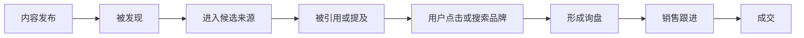

# 从这里开始

GEO-Master 不是一本必须从第一页顺序阅读的教科书。最有效的方式，是从你当前遇到的问题进入。

## 先做一件事：建立基线

在修改网站、发公众号、做 Reddit 或购买 GEO 服务之前，先记录当前状态：

- [AI 可见性基线测试 Playbook](playbooks/ai-visibility-baseline.md)
- [30 条中英文基线问题集](templates/baseline-query-set.csv)
- [每周 GEO 监测表](templates/weekly-monitoring.csv)

这样后续才能判断变化来自优化、平台波动还是偶然结果。

## 你的品牌完全不被 AI 提到

先做：

1. 建立 20–50 个真实用户问题；
2. 测试 ChatGPT、Perplexity、Gemini、豆包等平台；
3. 检查官网、第三方平台和社媒上的品牌事实是否一致；
4. 找出竞争对手被引用的来源类型；
5. 建立品牌事实库并修正名称、定位和参数冲突。

建议阅读：

- [AI 可见性基线测试](playbooks/ai-visibility-baseline.md)
- [品牌提及、来源引用和明确推荐的区别](explainers/mentions-vs-citations.md)
- [TP-006：品牌事实库怎么搭建](cases/third-party-operations/cases/TP-006-lijinlong-brand-fact-base/README.md)

## AI 会提到品牌，但不会引用官网

重点排查：

- 官网是否真正回答用户问题；
- 页面是否可访问并被搜索系统发现；
- 第三方来源是否比官网更具体、更适合作为证据；
- 产品页是否只有营销口号，没有可验证数据；
- 页面中的关键结论是否能被独立提取；
- 官网是否缺少测试报告、案例、售后和限制条件。

建议阅读：

- [TP-005：一个被 AI 频繁推荐的官网，长什么样](cases/third-party-operations/cases/TP-005-laoqian-ai-friendly-website/README.md)
- [Case 001：实验室仪器 Reddit GEO](cases/b2b-industrial/case-001-lab-instrument-reddit/README.md)

## AI 引用了官网，但产品参数是错的

重点排查：

- 多语言页面参数冲突；
- 旧产品页、PDF、经销商页仍可访问；
- Schema 与正文不一致；
- 型号、单位和版本命名不统一；
- 页面更新时间不明确；
- 已停产产品没有清晰状态；
- 第三方页面长期未更新。

优先修复事实准确性，不要先追求更多提及。

## 竞争对手总在推荐列表里

不要先复制竞品内容。先拆解：

- 竞品出现在哪类问题中；
- 被哪些第三方来源支持；
- 竞品拥有哪些你没有的证据；
- 你的差异化是否有原始数据支撑；
- 竞品是被提及、被引用，还是被明确推荐；
- 推荐理由来自参数、案例、社区口碑还是地域服务。

建议阅读：

- [TP-002：用 Reddit 反向挖掘真实需求](cases/third-party-operations/cases/TP-002-ahrefs-reddit-demand-research/README.md)
- [AI 可见性基线测试](playbooks/ai-visibility-baseline.md)

## Reddit 上有负面讨论

不要批量发布“正面回复”冲淡负面信息。优先：

1. 判断负面反馈是否真实；
2. 修复产品或服务问题；
3. 公开提供解决方案、版本变化和补救措施；
4. 在相关讨论中透明回应；
5. 必要时披露品牌、雇佣或供应商关系；
6. 持续监测 AI 是否引用过时负面信息。

建议阅读：

- [TP-004：Tenten Reddit GEO 三步法拆解](cases/third-party-operations/cases/TP-004-tenten-reddit-geo-teardown/README.md)

## 做了很多内容，但没有询盘

按照漏斗逐层检查：

不要用最终订单数字反推每个中间环节都有效。

重点检查：

- 测试问题是否具有采购或交易意图；
- 被引用的是知识页还是产品和报价页；
- 官网是否有明确的下一步动作；
- 地区、价格、交付和售后是否匹配；
- GA4、CRM 和销售是否记录来源；
- 同期是否存在广告、促销和季节性影响。

## 想学习国内 GEO

建议顺序：

1. [国内 GEO 原文与信源索引](references/DOMESTIC-GEO-SOURCES.md)
2. [国内 GEO 执行手册](playbooks/DOMESTIC-GEO-PLAYBOOK.md)
3. [TP-005：AI 友好官网结构](cases/third-party-operations/cases/TP-005-laoqian-ai-friendly-website/README.md)
4. [TP-006：品牌事实库](cases/third-party-operations/cases/TP-006-lijinlong-brand-fact-base/README.md)

## 想提交案例或纠错

- [案例库](cases/README.md)
- [案例模板](CASE-TEMPLATE.md)
- [证据评级标准](EVIDENCE-STANDARD.md)
- [贡献指南](CONTRIBUTING.md)
- 使用 GitHub Issues 中的“提交 GEO 案例”或“信源补充与纠错”表单

## 推荐的完整阅读顺序

1. [案例库](cases/README.md)
2. [AI 可见性基线测试](playbooks/ai-visibility-baseline.md)
3. [证据标准](EVIDENCE-STANDARD.md)
4. [执行 Playbook](playbooks/README.md)
5. [技术解释](explainers/README.md)
6. [模板与数据资产](templates/README.md)
7. [第三方运营案例索引](cases/third-party-operations/CASE-INDEX.md)
8. [90 天路线](ROADMAP.md)