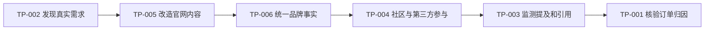

# 第三方 GEO 运营案例索引

本页只记录具体案例，不记录泛泛观点。案例数据默认视为“案例方宣称”，直到完成证据核验。

## 已发布或拆解中

| ID | 案例 | 来源类型 | 核心动作 | 结果或主张 | 证据等级 | 状态 |
|---|---|---|---|---|---|---|
| TP-001 | [实验室仪器 Reddit GEO：“136 单”案例拆解](../b2b-industrial/case-001-lab-instrument-reddit/README.md) | 公众号案例 | Perplexity 找帖、Reddit 参与、Ahrefs 观察、官网内容沉淀 | 136 单/月 | D：案例方宣称 | 已发布初版 |
| TP-002 | [Ahrefs 如何用 Reddit 反向挖掘真实需求](cases/TP-002-ahrefs-reddit-demand-research/README.md) | 官方博客 | 搜索运算符、Subreddit 排名分析、需求验证、官网内容转化 | 未提供订单结果 | B：公开方法可复现 | 已发布 |
| TP-003 | [Ahrefs Brand Radar 的 AI 可见性监测工作流](cases/TP-003-ahrefs-brand-radar-monitoring/README.md) | 官方产品与帮助文档 | 固定问题集、跨平台监测、来源分析、竞争对手比较 | 提供抽样监测能力 | A：官方能力确认 | 已发布 |
| TP-004 | [Tenten“Reddit GEO 三步法”拆解](cases/TP-004-tenten-reddit-geo-teardown/README.md) | 服务商博客 | Reddit 选题、专业参与、官网沉淀、AI 复测 | 标题宣称可大量获得 AI 引用 | C/D：方法可测，效果未证实 | 已发布 |
| TP-005 | [老钱聊GEO：一个被 AI 频繁推荐的官网，长什么样？](cases/TP-005-laoqian-ai-friendly-website/README.md) | 公众号稳定转载 | 首页定位、产品页、案例中心、行业内容、FAQ | 相似结构更容易被 AI 理解和推荐 | D：经验观察，缺样本 | 已发布 |
| TP-006 | [招财兔 GEO：品牌事实库怎么搭建？](cases/TP-006-lijinlong-brand-fact-base/README.md) | 作者个人站 | 品牌事实建模、来源绑定、版本管理、多平台同步、AI 复测 | 信息一致有助于减少错误描述 | C/D：方法合理，效果待实验 | 已发布 |

## 当前案例链路



### 海外渠道线

- **TP-002：需求发现。** Reddit 是用户问题、痛点和购买语言数据库。
- **TP-004：渠道执行与营销宣称核验。** 保留可复制 SOP，检查“疯狂引用”等强承诺。
- **TP-003：结果监测。** 区分提及、引用、推荐位置和参数准确性。
- **TP-001：商业归因。** 检查所谓订单结果是否能追溯到 GEO 链路。

### 国内内容线

- **TP-005：官网结构。** 将公众号经验文章转化为 5 页面改造和 30 天对照实验。
- **TP-006：品牌事实库。** 将“信息一致”补成 YAML/CSV 数据结构、审核流程和复测问题集。
- [国内 GEO 执行手册](../../playbooks/DOMESTIC-GEO-PLAYBOOK.md)：把招财兔第 72–100 篇按治理、监测、内容和资产重新组织。
- [国内 GEO 原文与信源索引](../../references/DOMESTIC-GEO-SOURCES.md)：保留作者原文、稳定转载和微信反查线索。

## 待核验案例池

以下只是研究线索，尚未作为事实写入正式案例。

| ID | 案例方向 | 可能来源 | 拟核验的关键问题 | 状态 |
|---|---|---|---|---|
| TP-007 | 户外电源 Reddit / Perplexity 获客 | 公众号、服务商复盘 | 品牌是谁；所谓成交额如何归因；是否存在原始 Reddit 帖和后台数据 | 待收集 |
| TP-008 | 庭院机器人负面讨论治理与正面提及率 | 行业案例文章 | “0→67%”的测试问题、样本量、平台、周期和原始回答 | 待收集 |
| TP-009 | 智能家居品牌 Perplexity 出现率提升 | 服务商案例 | “0→35%”是品牌提及还是引用；测试集和运行次数 | 待收集 |
| TP-010 | 微信搜一搜 + DeepSeek 的 B2B 内容截流 | 壹通GEO等内容线索 | S.P.E.C. 写法的具体页面、前后指标、线索归因 | 待收集 |
| TP-011 | 金融 / 教育 / 医疗 GEO 证据链和知识图谱 | 柏导叨叨等内容线索 | 行业案例是否匿名；知识图谱具体做法；合规边界 | 待收集 |
| TP-012 | 元宝 / 豆包 / Kimi 多平台 GEO 适配 | 招财兔 GEO、盒创GEO流量前沿等 | 平台差异是否有重复实验；哪些动作是平台特有 | 待收集 |
| TP-013 | 公众号内容从 SEO 转向 GEO | 羊小弟的时光机、花见策等 | 标题、结构、账号信号变化前后的收录、引用或流量 | 待收集 |
| TP-014 | GEO 爆款文章公式 | 铂康易汇推广等 | 所谓公式适用于阅读量、搜索曝光还是 AI 引用；样本量多少 | 待收集 |
| TP-015 | 本地生活账号的 GEO 运营 | 阿远的知学小窝、桂雪传媒等 | 本地查询、账号信号和转化的完整链路 | 待收集 |
| TP-016 | 批量城市 GEO 服务商页面 | 李金龙个人站等 | 模板重复度、真实本地数据、收录、AI 引用和商业结果 | 计划实验 |

## 每个案例重点核验什么

### 1. 业务真实性

- 是否有明确行业、品牌或项目背景；
- 是否说明原本的获客渠道和问题；
- 是否能确认内容不是纯粹的虚构演示。

### 2. 执行动作

- 具体发布了什么内容；
- 发布到哪些平台；
- 执行频率、周期和人员投入；
- 使用了哪些工具；
- 官网做了哪些对应修改。

### 3. AI 可见性

- 测试了哪些问题；
- 测试 ChatGPT、Perplexity、Gemini、豆包、DeepSeek 或其他哪个平台；
- 是否区分品牌提及、官网引用、推荐位置和参数正确性；
- 是否多次运行，而不是只保留一次有利回答。

### 4. 商业结果

- 流量来自哪里；
- 询盘如何记录；
- 订单如何归因；
- 是否排除了广告、传统 SEO、老客户和销售跟进等其他因素。

### 5. 合规风险

- 是否伪装普通用户；
- 是否隐藏商业关系；
- 是否批量制造评论、口碑或虚假背书；
- 是否包含医疗、金融、教育等高风险行业的不当承诺。

## 推荐拆解顺序

优先级按照以下公式判断：

```text
传播价值 × 方法完整度 × 数据可核验性 × 可复现程度
```

建议优先处理：

1. 有具体品牌、数字和时间周期的案例；
2. 有完整 SOP、Prompt 或工具链的案例；
3. 有后台截图、原始回答或公开帖子链接的案例；
4. 能够用 GEO-Master 自己复现的案例；
5. 有明显争议、失败或合规风险的案例。

## 提交一个新案例

请使用同目录下的 [CASE-SUMMARY-TEMPLATE.md](CASE-SUMMARY-TEMPLATE.md)，并至少提供原始文章标题、公众号名称、发布日期和来源链接。