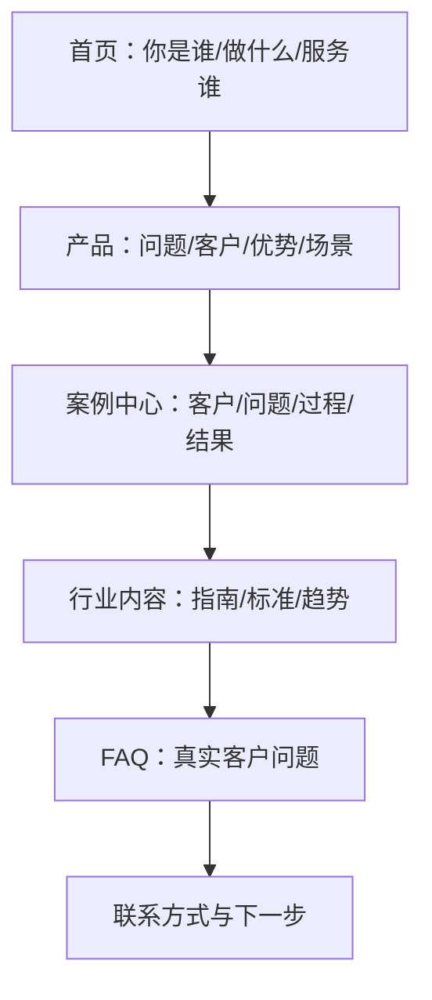

# TP-005：老钱聊GEO「一个被 AI 频繁推荐的官网，长什么样？」拆解

```yaml
case_id: TP-005
source_name: 老钱聊GEO
source_type: wechat-repost
source_title: 一个被AI频繁推荐的官网，长什么样？
source_url: https://www.uweb.net.cn/zhishiku/wangzhanxitongAIjieru/36223.html
published_at: 2026-06-09
industry: enterprise-website
channels: [official-website]
ai_platforms: [Doubao, DeepSeek]
case_type: method-teardown
claimed_result: 被 AI 频繁推荐的网站具有相似结构
result_status: unverified-observation
evidence_level: D
last_checked: 2026-07-17
```

## 原文入口

- [稳定转载：优网科技，页面注明来源为“老钱聊GEO”](https://www.uweb.net.cn/zhishiku/wangzhanxitongAIjieru/36223.html)
- 微信搜索临时链接可能失效，长期可在公众号“老钱聊GEO”搜索完整标题。

## 30 秒摘要

原文认为，被豆包、DeepSeek 等 AI 频繁引用或推荐的企业官网，通常具有清晰定位、具体产品说明、案例中心、行业内容、FAQ 和明确联系方式。这个方向具有较强的实际参考价值，但原文没有公开样本网站、测试问题、运行次数和前后对照，因此应视为**经验观察和官网改造启发**，不能视为已证明的 AI 排名规则。

## 原文方法图



## 一、原文解决的业务问题

许多企业官网的主要问题不是页面不漂亮，而是信息无法快速回答：

- 这家公司到底做什么；
- 它服务谁；
- 产品解决什么问题；
- 是否有真实项目经验；
- 用户应该如何选择；
- 下一步如何联系。

这些问题同时影响真人用户、传统搜索和生成式搜索检索。

## 二、原文提出的官网结构

### 1. 首页定位

建议首屏直接说明：

```text
企业/品牌是谁
+ 提供什么产品或服务
+ 服务哪类客户
+ 解决什么问题
```

不建议只写“创新驱动未来”“科技赋能产业”等无法验证的口号。

### 2. 产品与服务页

不要只列产品名称，至少回答：

- 解决什么问题；
- 适合什么用户；
- 不适合什么用户；
- 关键参数和限制；
- 使用场景；
- 选择标准；
- 相关案例。

### 3. 案例中心

建议统一案例结构：

```text
客户背景
→ 原始问题
→ 选择方案
→ 实施过程
→ 数据结果
→ 限制和后续
```

案例数量本身不能证明专业性，关键在于是否具体、可验证、有结果口径。

### 4. 行业知识内容

将销售和客服中的真实问题沉淀为：

- 选型指南；
- 对比文章；
- 标准解读；
- 使用教程；
- 故障排查；
- 风险与避坑；
- 价格和交付逻辑。

### 5. FAQ

FAQ 不应只是“支持定制吗？支持”。更有效的 FAQ 应包含条件、范围和例外。

### 6. 联系方式

明确下一步：咨询、报价、下载资料、预约演示或查看产品，不要让用户自己寻找入口。

## 三、为什么这种结构可能有效

### 对真人用户

降低理解和决策成本，增强信任，并让用户更快进入下一步。

### 对搜索引擎

标题、正文、内链和主题结构更清晰，更容易判断页面意图。

### 对生成式搜索

直接答案、事实块、表格、案例和 FAQ 更容易被拆成相关段落参与检索与引用。

但要注意：**结构清晰不等于一定被推荐**。平台还可能受到索引、查询相关性、来源质量、第三方佐证、新鲜度、地区和随机性影响。

## 四、证据矩阵

| 声明 | 原始支持 | 可复核性 | 等级 | 判断 |
|---|---|---:|---|---|
| 被推荐网站具有相似结构 | 作者称拆解了大量网站 | 低 | D | 有启发，但未公开样本 |
| 首页应直接说明企业定位 | 原文示例和通用信息架构原则 | 中 | C/D | 可通过用户测试和 AI 测试验证 |
| 案例中心越多越容易获得 AI 信任 | 原文经验观察 | 低 | D | “数量→信任”因果未经证明 |
| FAQ、行业内容有利于理解 | 内容结构逻辑 | 中 | C | 需要对照实验 |
| 官网会成为 AI 推荐关键入口 | 趋势判断 | 低 | D | 适用程度因平台而异 |

## 五、把文章改成可执行 SOP

### Step 1：建立官网现状基线

选择 20 个问题：

- 5 个品牌事实问题；
- 5 个产品选择问题；
- 5 个行业问题；
- 5 个对比或采购问题。

在目标平台各运行 3–5 次，记录提及、引用、推荐与准确率。

### Step 2：只改 5 个页面

优先改造：

1. 首页；
2. 核心产品页；
3. 代表案例；
4. FAQ；
5. 选型指南。

### Step 3：增加事实和边界

每个页面补充：

- 更新时间；
- 数据来源；
- 适合与不适合的场景；
- 参数解释；
- 真实案例；
- 相关页面内链。

### Step 4：等待索引后复测

不要当天修改、当天宣布成功。保存原始回答，至少连续观察 4 周。

## 六、官网页面模板

```markdown
# 页面主问题

用 2–3 句话直接回答。

## 适合谁

## 不适合谁

## 关键判断标准

| 标准 | 说明 | 数据来源 |
|---|---|---|

## 具体实施步骤

## 真实案例

## 常见错误

## FAQ

## 更新时间与负责人
```

## 七、原文中需要降级处理的表达

### “AI 喜欢这种网站”

更准确地写成：

> 这种网站结构可能提高信息清晰度和相关段落的可检索性，但是否被具体 AI 平台引用或推荐，需要通过固定问题集重复测试。

### “案例越多，AI 越信任”

案例的真实性、具体性和第三方可验证程度，通常比单纯数量更重要。

### “只有理解才会信任，只有信任才会推荐”

这是便于传播的比喻，不是公开的模型评分公式。

## 八、30 天复现实验

| 项目 | 设置 |
|---|---|
| 对象 | 一个已有企业官网 |
| 页面 | 首页、产品、案例、FAQ、指南各 1 页 |
| 问题 | 20 个固定问题 |
| 平台 | 豆包、DeepSeek、元宝或其他目标平台 |
| 基线 | 修改前每题运行 5 次 |
| 复测 | 第 14 天、第 30 天 |
| 指标 | 提及率、引用率、准确率、访问、询盘 |
| 对照 | 选择 5 个相似但不修改的页面 |

## 九、可以复制什么

- 首页一句话定位；
- 产品页加入使用场景和限制；
- 标准化案例中心；
- 从客服问题建设 FAQ；
- 以问题为入口建设行业内容；
- 修改前后重复测试。

## 十、不能直接复制什么

- 把“六个模块”当成所有平台通用排名公式；
- 大量虚构案例；
- 只增加 FAQ 数量而不提高回答质量；
- 用一次有利回答证明效果；
- 把官网结构变化直接归因到成交增长。

## 更新记录

| 日期 | 更新内容 |
|---|---|
| 2026-07-17 | 发布首版拆解、SOP 和复现实验 |