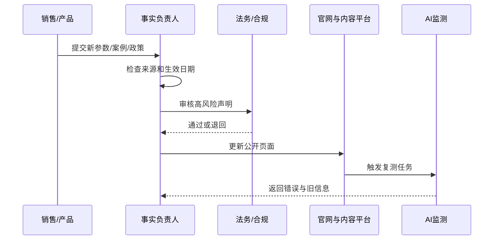

# TP-006：招财兔 GEO「品牌事实库怎么搭建？」拆解与实施版

```yaml
case_id: TP-006
source_name: 招财兔 GEO / 李金龙
source_type: author-website
source_title: 第 11 篇：品牌事实库怎么搭建？先让 AI 说对你是谁
source_url: https://www.lijinlong.cc/geo-youhua/4769.html
published_at: 2026-05-19
industry: general
channels: [official-website, wechat, zhihu, baijiahao, pdf]
ai_platforms: [domestic-ai-platforms]
case_type: method-teardown
claimed_result: 统一品牌事实有助于 AI 正确理解和引用企业
result_status: plausible-method-unverified-effect
evidence_level: C-D
last_checked: 2026-07-17
```

## 原文入口

- [作者个人站原文：品牌事实库怎么搭建？先让 AI 说对你是谁](https://www.lijinlong.cc/geo-youhua/4769.html)
- [作者 GEO 文章归档](https://www.lijinlong.cc/tag/geo%E4%BC%98%E5%8C%96/)

## 30 秒摘要

原文的核心建议是：企业不要急着批量发文，应先统一企业名称、产品、服务、案例和联系方式，再把这些事实同步到官网、公众号、知乎、百家号、资料页等信源中，并持续复测 AI 是否描述正确。

这个方向非常适合工程化实施，但原文没有提供品牌事实库的具体数据结构、变更流程、冲突处理规则和效果对照。本案例将它补成一个可直接放进 GitHub 或企业知识库的实施方案。

## 方法闭环


## 一、品牌事实库解决什么问题

常见错误包括：

- 公司全称和品牌简称混用；
- 官网说成立于 2018 年，媒体稿说成立于 2019 年；
- 产品参数在不同页面不一致；
- 已停产型号仍被 AI 推荐；
- 服务地区、价格和交付周期已经变化；
- 案例只有营销结论，没有客户、时间和数据口径；
- 第三方页面的信息比官网更新。

品牌事实库的目标不是“喂给大模型一个隐藏文件”，而是建立企业内部唯一可信事实源，再将其发布到公开、可验证、可维护的页面。

## 二、事实库应该包含哪些内容

### 企业实体

- 法定名称；
- 品牌名、英文名和常见简称；
- 成立时间；
- 总部与服务地区；
- 官网和官方账号；
- 联系方式；
- 主营业务；
- 负责人信息。

### 产品与服务

- 标准名称和型号；
- 核心功能；
- 技术参数；
- 适用与不适用场景；
- 认证和检测报告；
- 价格逻辑；
- 交付周期；
- 售后政策；
- 状态：在售、暂停、停产。

### 案例与证据

- 客户或匿名规则；
- 时间范围；
- 原始问题；
- 实施动作；
- 结果指标；
- 数据来源；
- 可公开程度；
- 限制和其他可能解释。

## 三、推荐数据结构

### `brand-facts.yaml`

```yaml
brand:
  canonical_name: Example Brand
  legal_name: Example Technology Co., Ltd.
  aliases:
    - Example
    - Example Tech
  website: https://example.com
  founded_at: 2018-05-01
  headquarters:
    country: CN
    city: Shenzhen
  last_verified: 2026-07-17

claims:
  - id: claim-001
    subject: Example Brand
    predicate: serves
    object: B2B laboratory customers
    status: verified
    effective_from: 2025-01-01
    effective_to: null
    sources:
      - https://example.com/about
    owner: marketing
    reviewed_by: legal

products:
  - sku: EX-100
    canonical_name: Example Analyzer EX-100
    status: active
    specifications:
      accuracy: "±0.5%"
      voltage: "220V"
    source: https://example.com/products/ex-100
    updated_at: 2026-06-30
```

### `claims-and-sources.csv`

| claim_id | 声明 | 状态 | 官方来源 | 第三方来源 | 生效日期 | 失效日期 | 负责人 |
|---|---|---|---|---|---|---|---|
| C001 | 公司成立于 2018 年 | verified | 官网 | 工商信息 | 2018-05-01 |  | 法务 |
| C002 | 服务 500+ 客户 | needs-review | 案例页 | 无 | 2026-01-01 |  | 销售 |

## 四、事实的状态管理

不要只有“有/无”，建议至少分为：

| 状态 | 含义 | 是否允许公开 |
|---|---|---|
| verified | 已有可靠来源并审核 | 是 |
| pending | 正在核验 | 否或加说明 |
| disputed | 来源冲突 | 否 |
| expired | 已过期 | 只用于历史记录 |
| confidential | 商业机密 | 否 |
| claimed | 企业或案例方宣称，缺独立证据 | 必须标注 |

## 五、变更流程



## 六、发布到哪些页面

事实库本身可以是内部 YAML、表格或数据库，但公开事实需要进入：

- 官网 About / Company 页面；
- 产品和服务页面；
- 参数、认证和下载中心；
- 案例中心；
- FAQ；
- 变更日志；
- 公众号和视频号简介；
- 知乎、百家号等官方账号；
- 白皮书、说明书和 PDF；
- 获得授权的行业目录和媒体资料页。

原则：不要所有平台都贴完全一样的长文，但关键事实必须一致。

## 七、AI 复测问题集

### 品牌身份

- X 公司是做什么的？
- X 品牌和 X 公司是什么关系？
- X 的总部在哪里？

### 产品事实

- X 的主要产品有哪些？
- X 型号是否还在售？
- X 产品适合什么场景？

### 商业决策

- X 和竞品 Y 有什么区别？
- 什么类型的企业适合选择 X？
- X 有哪些认证和真实案例？

每题记录：是否提及、是否引用、事实是否准确、引用是否为最新页面。

## 八、证据矩阵

| 声明 | 原文支持 | 可复核性 | 等级 | 判断 |
|---|---|---:|---|---|
| 品牌信息一致可减少 AI 混淆 | 原文方法论、常识性信息治理逻辑 | 中 | C | 值得实施和测试 |
| 事实库能让企业成为 AI 答案来源 | 原文判断 | 低 | D | 还受平台索引和竞争影响 |
| 定义、步骤、表格和 FAQ 更便于摘取 | 原文经验 | 中 | C/D | 可通过页面对照实验验证 |
| 发布后应持续复测 | 原文行动清单 | 高 | B/C | 属于必要测量方法 |
| “AI 最怕信息混乱” | 拟人化表达 | 低 | D | 应改写为信息冲突可能导致错误回答 |

## 九、原文的内容质量观察

原文提供了清晰的“诊断—问题—发布—复测”框架，但也存在值得研究的现象：

- 第 1–100 篇在同一天密集发布；
- 多篇文章结构和部分段落高度相似；
- 文中出现“全平台”等明显泛化占位表达；
- 缺少具体品牌、基线、原始回答和结果数据；
- “更容易被引用”等效果没有对照实验。

因此，本仓库将其视为**选题地图和执行框架来源**，而不是 100 个独立成功案例。

## 十、7 天实施清单

### Day 1：盘点

- [ ] 收集官网、公众号、销售材料中的品牌介绍；
- [ ] 找出名称、时间、参数和服务范围冲突。

### Day 2：建模

- [ ] 创建 `brand-facts.yaml`；
- [ ] 创建 `claims-and-sources.csv`；
- [ ] 为每条事实设置负责人。

### Day 3：核验

- [ ] 检查工商、认证、报告和合同依据；
- [ ] 标记 claimed、pending 和 expired。

### Day 4–5：发布

- [ ] 更新官网核心页；
- [ ] 修正公众号和外部账号简介；
- [ ] 发布事实更新说明。

### Day 6：建立基线

- [ ] 运行 20 个身份、产品和决策问题；
- [ ] 保存完整回答和引用。

### Day 7：复盘

- [ ] 记录错误事实；
- [ ] 判断错误来源；
- [ ] 制定下一轮页面修正计划。

## 十一、可以复制什么

- 建立唯一品牌事实源；
- 每条声明绑定来源与负责人；
- 管理事实的生效、失效和争议状态；
- 官网和外部平台保持关键事实一致；
- 用固定问题集持续复测。

## 十二、不能直接复制什么

- 把内部 YAML 当成平台必定读取的特殊文件；
- 为了“信息一致”而在所有平台批量发布重复文章；
- 没有证据也把营销口号写成 verified；
- 用同一个模板生成大量行业或城市页面；
- 只看品牌有没有被提到，不检查事实是否正确。

## 延伸阅读

- [国内 GEO 执行手册](../../../../playbooks/DOMESTIC-GEO-PLAYBOOK.md)
- [国内 GEO 原文与信源索引](../../../../references/DOMESTIC-GEO-SOURCES.md)
- [证据与案例评级标准](../../../../EVIDENCE-STANDARD.md)

## 更新记录

| 日期 | 更新内容 |
|---|---|
| 2026-07-17 | 发布首版拆解、数据结构与 7 天实施方案 |