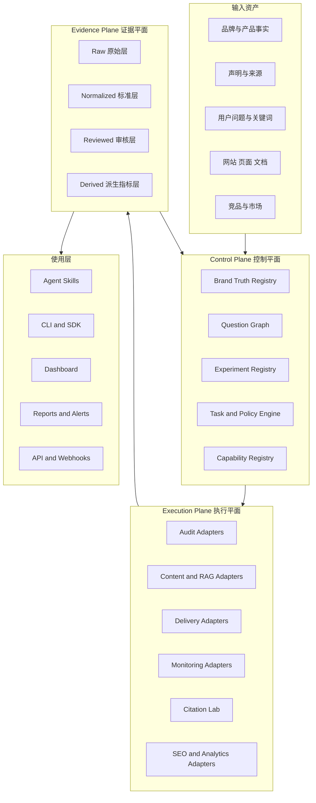

# GEO-Master 平台架构蓝图

> 目标：把 GEO-Master 从“资料、模板和 Skill 工具箱”升级为一个可扩展、可验证、可私有化的 **GEO Operating System**。

GEO-Master 不复制所有上游项目，也不试图把所有功能塞进一个巨型单体应用。它吸收上游的有效能力，将它们统一到一套稳定的事实、任务、证据和监测契约中。

```text
研究 → 事实 → 问题 → 审计 → 内容 → 发布 → 监测 → 引用实验 → 归因 → 下一轮优化
```

## 1. 产品定位

GEO-Master 的目标不是成为另一个：

- 只生成 `llms.txt` 的工具；
- 只给网站打一个 0–100 分的审计器；
- 只批量生成文章的内容工厂；
- 只定时调用模型的 Prompt Tracker；
- 只收集 GEO 链接的 Awesome List；
- 只在一个平台上检测一次品牌提及的 Demo。

它要成为这些能力之上的统一控制层：

```text
GEO-Master Core
  定义事实、问题、任务、实验、证据、结果与治理边界

GEO-Master Adapters
  连接审计器、内容系统、发布渠道、模型执行器、SEO 数据与监测平台

External Runtimes
  保留上游工具独立部署、独立升级与独立许可证责任
```

## 2. 判断“比现有项目更好”的标准

不是代码更多、功能按钮更多，而是同时做到：

1. **全链路**：从品牌事实到商业结果，不只解决单一环节；
2. **证据优先**：总分必须能回溯到底层检查、原始回答、引用 URL 和审核状态；
3. **平台中立**：同一数据契约容纳官方 API、人工测试、浏览器自动化和第三方数据；
4. **国内外双覆盖**：国际平台与 DeepSeek、豆包、元宝、Kimi、通义等中文平台处在同一体系；
5. **上下文完整**：记录地区、语言、登录状态、Web/App、会话状态、模型和采集方式；
6. **事实不漂移**：内容生成、改写和多语言版本都受品牌事实库与来源约束；
7. **真实复测**：技术可访问、内容高分和 `llms.txt` 都不能替代真实平台提及与引用测试；
8. **可插拔**：每个外部工具可替换，不锁死在单一供应商、模型或数据库；
9. **许可证安全**：MIT、Apache、GPL、CC 和第三方材料有明确集成边界；
10. **业务不过度归因**：AI 提及、访问、询盘和订单分层记录，不制造虚假因果。

## 3. 总体架构



### 3.1 Control Plane

控制平面保存“做什么、为什么做、依据是什么”，而不是保存所有外部工具的实现细节。

| 模块 | 核心对象 | 作用 |
|---|---|---|
| Brand Truth Registry | brand、product、claim、source、version | 防止内容、模型判断和报告使用冲突事实 |
| Question Graph | query、intent、persona、market、language、funnel | 将关键词升级为真实用户问题资产 |
| Experiment Registry | experiment、variant、control、metric、evidence | 管理优化前后、平台差异和引用吸收实验 |
| Task and Policy Engine | task、approval、risk、schedule、retry | 约束生成、审核、发布和监测流程 |
| Capability Registry | capability、upstream、license、adapter、status | 记录能力来自哪里、怎么吸收、禁止做什么 |

### 3.2 Execution Plane

执行平面不要求使用某一套工具。每类能力至少允许两种实现：GEO-Master 原生实现或外部适配器。

```text
Audit
  GeoReady / aeo.js / Dualmark / 自研规则

Content
  GEOFlow / AutoGEO 思路 / GEO Analyzer / Agent Skills

Delivery
  GEOFlow Agent / WordPress REST / HTTP API / 静态构建

Monitoring
  Getcito / Gego / Searchstack / Elmo / GEO-AEO Tracker / 人工运行

Research
  GEO-Bench / AutoGEO / Citation Lab
```

### 3.3 Evidence Plane

所有数据必须分层，禁止覆盖原始证据：

```text
Raw
  原始回答、截图、抓取响应、页面快照、日志

Normalized
  monitor-run、citation、audit finding、content artifact

Reviewed
  人工或机器审核状态、争议、修订说明

Derived
  提及率、官网引用率、推荐率、事实准确率、Share of Voice、趋势
```

派生指标可以重新计算；原始证据不能被派生指标替代。

## 4. 统一适配器契约

每个适配器都应实现相同生命周期，即使底层是 CLI、HTTP、MCP、数据库导出或人工表格。

```text
1. discover   声明能力、版本、许可证和运行要求
2. plan       根据项目与任务生成执行计划，不直接执行高风险动作
3. execute    调用外部工具或运行原生逻辑
4. normalize  转换为 GEO-Master Schema
5. verify     校验完整性、证据、缺失值和上下文
6. report     返回结果、警告、成本和后续动作
```

建议的适配器输出：

```json
{
  "adapter": "vendor-or-tool-name",
  "adapter_version": "0.1.0",
  "capability_id": "prompt-monitoring",
  "project_id": "PROJECT-EXAMPLE",
  "task_id": "TASK-EXAMPLE",
  "status": "completed",
  "raw_artifacts": [],
  "normalized_artifacts": [],
  "warnings": [],
  "cost": null,
  "evidence_state": "machine_reviewed"
}
```

具体业务数据继续使用对应 Schema，例如 `monitor-run.schema.json`，而不是把所有结果压进一个万能对象。

## 5. 上游能力如何成为 GEO-Master 的子集

完整、机器可读的状态见：

- [`integrations/upstream-capabilities.json`](../integrations/upstream-capabilities.json)
- [`schemas/integration-registry.schema.json`](../schemas/integration-registry.schema.json)

### 5.1 研究与方法层

| 上游 | 吸收能力 | GEO-Master 增强 |
|---|---|---|
| `GEO-optim/GEO` | GEO-Bench、优化方法、可见性实验 | 加入真实品牌事实、地区、界面和长期复测 |
| `cxcscmu/AutoGEO` | 引擎偏好规则、自动改写、效用约束 | 增加事实锁、来源约束、人工审核和多语言比较 |
| `yaojingang/geo-citation-lab` | 引用选择、吸收、实体曝光 | 连接统一监测 Schema、品牌事实和争议审核 |

### 5.2 技术发现与站点层

| 上游 | 吸收能力 | GEO-Master 增强 |
|---|---|---|
| `Auriti-Labs/geo-optimizer-skill` | AI Bot、robots、llms、Schema、审计和漂移 | 拆解总分，连接真实问题和优化后引用复测 |
| `houtini-ai/geo-analyzer` | Claim 密度、答案前置、实体和可引用性 | 加入事实准确性、中文内容和来源可靠性 |
| `dodopayments/dualmark` | Markdown Twin、内容协商和验证 | 将可访问性与实际引用结果分开 |
| `multivmlabs/aeo.js` | 多框架 AI 文件生成和站点检查 | 纳入统一审计，不把文件生成视为 GEO 完成 |
| `jeredhiggins/llms-generator-toolkit` | 网页转 Markdown、导航和 llms.txt | 增加事实去重、版本、优先级和输出验证 |
| `AnswerDotAI/llms-txt` | 格式与发现提案 | 明确它不是平台官方排名协议 |

### 5.3 内容运营与发布层

| 上游 | 吸收能力 | GEO-Master 增强 |
|---|---|---|
| `yaojingang/GEOFlow` | 知识库、RAG、任务、审核、多站发布 | GEO-Master 提供事实、问题、实验和监测控制层 |
| `yaojingang/GEORank` | 诊断、问答、方案、拓词和结构化工具 | 不依赖玄学总分，保留原始证据和复测 |
| `aaron-he-zhu/aaron-marketing-skills` | Skill 契约、阶段交接、质量门禁 | 聚焦 GEO 证据链和国内外平台差异 |
| `indranilbanerjee/digital-marketing-pro` | 多品牌、标准交付、合规和复盘 | 不膨胀为全营销平台，保持 GEO 专项深度 |

### 5.4 监测、竞品与分析层

| 上游 | 吸收能力 | GEO-Master 增强 |
|---|---|---|
| `Getcito` | Prompt 追踪、引用、竞品、报告 | 国内平台、事实准确性、界面与证据状态 |
| `AI2HU/gego` | 多模型调度、品牌别名、域名分析 | 通过进程边界集成 GPL 项目，不污染 MIT Core |
| `Searchstack` | GSC、SERP、外链、AI 引荐和 CLI 报告 | 统一采集口径、国内平台和人工证据 |
| `Elmo` | 自托管 Prompt 运行、品牌与竞品监测 | 已有数据导入器，补充原始回答哈希和审核状态 |
| `GEO/AEO Tracker` | 多模型、地域、历史和漂移 | 已有数据导入器，不继承上游综合分 |

## 6. 核心数据对象

GEO-Master 应逐步稳定以下对象，而不是围绕页面按钮设计数据：

| 对象 | 示例 ID | 说明 |
|---|---|---|
| Project | `PROJECT-TALIX-US` | 一个品牌、市场或客户工作区 |
| Brand Fact | `FACT-TALIX-140W-001` | 可版本化的品牌或产品事实 |
| Claim | `CLAIM-TSA-001` | 对外声明及来源、风险和有效期 |
| Query | `QUERY-POWERBANK-001` | 用户问题、意图、地区、语言和人群 |
| Task | `TASK-CONTENT-001` | 审计、内容、发布或监测任务 |
| Content Artifact | `CONTENT-100W-COMPARE-001` | 页面、文章、FAQ、Schema 或 Markdown Twin |
| Monitor Run | `RUN-CHATGPT-US-001` | 一次真实或导入的 AI 平台运行 |
| Citation | `CITATION-001` | 引用 URL、位置、类型和吸收标签 |
| Experiment | `EXP-FRONTLOAD-001` | 优化前后与对照实验 |
| Business Event | `LEAD-001` | 访问、询盘、报价和订单的独立记录 |

## 7. 平台差异必须保留

以下结果不能合并成一个“模型分数”：

```text
官方 API
消费者 Web
消费者 App
浏览器自动化
第三方抓取
数据供应商表示
本地模型
```

同一个产品也必须记录：

- 国家与城市；
- 语言和区域设置；
- 登录状态和套餐；
- 新会话或多轮会话；
- Web、移动 Web 或原生 App；
- 是否显示搜索过程；
- 采集时间、模型标签和数据供应商。

## 8. 许可证架构

```text
MIT / Apache-2.0
  可采用适配器或独立重实现；复制实质代码时保留版权和 NOTICE

GPL
  只通过 HTTP、CLI 或独立进程边界集成；不复制到 MIT Core

CC BY / 混合内容许可
  按材料逐项署名；代码许可和内容许可分开处理

未确认或第三方受限材料
  只记录来源、字段、方法和复现步骤，不入库正文或资产
```

所有上游必须在能力注册表中声明：

- 许可证与核验日期；
- 集成模式；
- 吸收状态；
- 保留能力；
- GEO-Master 差异化；
- 明确禁止项。

## 9. 实施路线

### Phase 0：平台地基

- [x] 能力与上游注册表；
- [x] 注册表 JSON Schema；
- [x] 许可证和引用完整性校验；
- [x] CI 自动验证；
- [ ] 统一 Adapter Result Schema；
- [ ] Adapter SDK 最小接口。

### Phase 1：技术审计闭环

- [ ] GeoReady CLI JSON 适配器；
- [ ] aeo.js / Dualmark 检测与建议选择器；
- [ ] 审计结果映射为底层 Finding，而不是只保存总分；
- [ ] 审计前后复测模板。

### Phase 2：多模型监测闭环

- [ ] Getcito HTTP/导出适配器；
- [ ] Gego 外部服务适配器；
- [ ] Searchstack CLI 适配器；
- [ ] 完成 Elmo 与 GEO/AEO Tracker 适配测试；
- [ ] 国内平台人工与自动采集规范。

### Phase 3：内容与分发闭环

- [ ] GEOFlow 项目、事实、问题和任务 ID 映射；
- [ ] Content Artifact Schema；
- [ ] AutoGEO 式受控改写实验；
- [ ] 事实锁、来源锁和发布审批门禁；
- [ ] WordPress、HTTP 和静态站结果回写。

### Phase 4：统一使用层

- [ ] `geo-master` CLI；
- [ ] Python SDK；
- [ ] 轻量 Dashboard；
- [ ] 周报、月报和漂移告警；
- [ ] 多品牌和客户隔离。

### Phase 5：生态与市场

- [ ] Adapter Marketplace；
- [ ] 行业问题包；
- [ ] 国内外 Provider Acceptance Matrix；
- [ ] 可公开复现的品牌实验；
- [ ] 企业私有化部署参考架构。

## 10. 第一条端到端验收链

平台第一个真正的验收目标不是“做完后台”，而是让一个品牌完整跑通：

```text
1. 建立品牌事实与来源
2. 导入 20–30 个真实问题
3. 运行网站技术审计
4. 建立多平台可见性基线
5. 生成一个证据化内容 Brief
6. 修改或发布一个页面
7. 重跑相同问题与环境
8. 比较提及、引用、推荐和准确性
9. 保存原始回答和引用证据
10. 单独记录访问、询盘和订单
```

只有这条链可重复运行、可审查、可更换外部工具时，GEO-Master 才真正成为 Master，而不是另一个功能集合。
