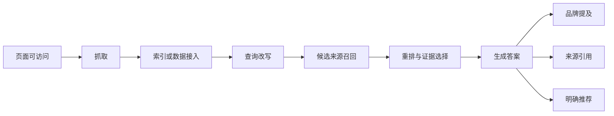

# GEO 技术解释

> 只解释案例和执行真正需要理解的技术，不把仓库变成术语百科。

## 先理解这条链路

这条链路中，前一步成立不代表后一步一定成立：

- 被抓取不等于被索引；
- 被索引不等于进入候选来源；
- 被召回不等于被引用；
- 被提及不等于被推荐；
- 被推荐不等于产生访问和订单。

## 已发布

### [品牌提及、来源引用和明确推荐有什么区别](mentions-vs-citations.md)

用于统一 GEO 项目的指标口径，避免把不同结果混为一谈。

## 计划内容

| 主题 | 要解决的实际问题 |
|---|---|
| Query Fan-out | 为什么一个用户问题会衍生多个检索方向 |
| Passage Retrieval | 为什么 AI 可能引用页面中的一小段而不是整篇文章 |
| Retrieval 与 Rerank | 为什么页面已被收录但仍不进入答案 |
| 实体一致性 | 为什么品牌名、型号和参数冲突会导致错误回答 |
| Freshness | 为什么 AI 仍然使用旧价格、旧型号和旧政策 |
| 第三方来源 | 为什么 AI 有时更愿意引用媒体、论坛和评测站 |
| 多轮对话漂移 | 为什么同一个用户继续追问后推荐结果会变化 |
| 地域和个性化 | 为什么不同账号、地区和时间看到不同答案 |
| 归因限制 | 为什么无法把所有订单都归因给 GEO |

## 技术文章写作标准

每篇解释必须按照以下顺序：

1. **案例现象**：用户实际看到了什么；
2. **通俗解释**：不使用术语也能理解；
3. **技术链路**：现象发生在哪个环节；
4. **实施影响**：团队应该修改什么；
5. **验证方法**：如何通过测试判断；
6. **未知与限制**：哪些机制平台没有公开。

## 证据边界

不同平台不会公开完整的来源选择、重排和答案生成算法。仓库会明确区分：

- 平台官方说明；
- 论文或公开技术报告；
- 可以重复的黑盒实验；
- 单次观察；
- 服务商经验；
- 无法验证的推测。

技术解释的作用是帮助设计实验，不是包装一套“必然被 AI 推荐”的神秘公式。