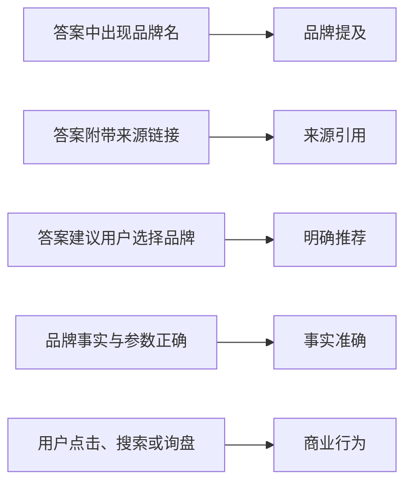
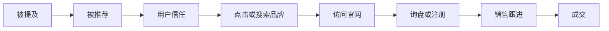

# 品牌提及、来源引用和明确推荐有什么区别

GEO 项目最常见的统计错误，是把“AI 说到了品牌”“AI 引用了官网”“AI 推荐了产品”当成同一件事。

它们实际上处于不同层级，商业意义也不同。

## 一张图看懂



这些结果可以同时出现，也可以彼此独立。

## 1. 品牌提及 Brand Mention

### 定义

AI 回答中出现了品牌的规范名称、常用别名或可以明确识别的产品品牌。

示例：

> 可以考虑 A、B 和 **[BRAND]**。

### 它能证明什么

只能证明这次回答中模型生成了品牌名称。

### 它不能证明什么

- 不证明品牌是主要推荐；
- 不证明信息来自官网；
- 不证明描述是正面的；
- 不证明参数正确；
- 不证明所有用户都会看到；
- 不证明产生了访问或订单。

### 应该额外记录

- 出现位置；
- 正面、中性还是负面；
- 是否属于推荐列表；
- 出现时的理由；
- 是否附带限制或警告。

## 2. 来源引用 Citation

### 定义

AI 回答将某个网页、文档、帖子或数据源展示为答案来源。

引用可以来自：

- 品牌官网；
- 官方帮助中心；
- 产品文档；
- 行业媒体；
- 评测网站；
- Reddit、知乎等社区；
- 经销商或电商页面；
- 政府或标准机构；
- 论文和报告。

### 官网引用和品牌提及可能分离

情况一：提到品牌，但没有引用官网。

```text
答案推荐 [BRAND]
来源却全部来自评测站和 Reddit
```

情况二：引用官网，但正文没有突出品牌。

```text
答案引用品牌技术文档中的参数
但推荐列表只出现了竞品名称
```

情况三：引用官网，但引用的是旧页面。

```text
旧型号 PDF 被引用
新产品页没有进入答案
```

### 应该额外记录

- 引用 URL；
- 官方还是第三方；
- 引用位置；
- 该来源支持答案中的哪一句话；
- 页面日期和版本；
- 是否存在跳转、失效或错误内容。

## 3. 明确推荐 Recommendation

### 定义

AI 不只是提到品牌，而是明确建议用户考虑、选择、购买、联系或优先评估它。

示例：

> 对于重视便携性和快速充电的商务用户，**[PRODUCT] 是更合适的选择之一**。

### 推荐强度可以分级

| 级别 | 示例 |
|---|---|
| R0：未出现 | 答案没有品牌 |
| R1：仅提及 | 在品牌列表中出现 |
| R2：候选 | “可以考虑” |
| R3：场景推荐 | “适合某类用户” |
| R4：优先推荐 | “首选”“最佳之一” |
| R5：交易引导 | 建议购买、申请报价或联系 |

### 推荐也可能是错误的

例如：

- 推荐了已经停产的型号；
- 推荐理由与真实参数不符；
- 推荐给不适合的用户；
- 推荐了非官方经销商；
- 忽略了安全、地域和售后限制。

因此，推荐率必须和事实准确率一起看。

## 4. 事实准确 Fact Accuracy

### 定义

AI 对品牌、产品和服务的关键描述是否与当前可靠事实一致。

建议检查：

- 品牌名称和公司主体；
- 产品型号；
- 技术参数；
- 单位；
- 认证；
- 价格和币种；
- 服务范围；
- 质保期限；
- 发布时间；
- 官方联系方式；
- 产品是否仍在售。

### 状态建议

| 状态 | 含义 |
|---|---|
| accurate | 关键事实正确 |
| partial | 部分正确，但存在缺失或不完整 |
| incorrect | 至少一个关键事实明确错误 |
| outdated | 信息过去正确，但已经过期 |
| conflicting | 答案内部或多个来源互相冲突 |
| unknown | 无足够证据判断 |

## 5. 可见性不等于商业转化

完整漏斗是：



每一步都会流失，也可能受其他渠道影响。

例如：

- 用户看到品牌后直接去 Amazon 搜索，没有点击引用；
- 用户访问官网，但页面没有清晰 CTA；
- 有询盘，但销售没有及时回复；
- 同期广告投放导致品牌搜索增加；
- 老客户复购被误算为 GEO 订单。

因此，不能把订单数直接除以 AI 提及次数得出“GEO 转化率”。

## 6. 推荐的指标表

| 指标 | 定义 | 最适合回答的问题 |
|---|---|---|
| 品牌提及率 | 提到品牌的运行次数 / 总运行次数 | AI 是否认识并考虑品牌？ |
| 官网引用率 | 引用官方来源的运行次数 / 总运行次数 | 官网是否成为证据来源？ |
| 第三方引用率 | 引用第三方来源的运行次数 / 总运行次数 | 哪些外部来源影响回答？ |
| 推荐率 | 明确建议考虑品牌的运行次数 / 总运行次数 | 品牌是否进入选择集合？ |
| Top 3 推荐率 | 品牌位于前三的运行次数 / 总运行次数 | 推荐位置是否有竞争力？ |
| 事实准确率 | 准确回答次数 / 可判断次数 | AI 是否说对品牌和产品？ |
| 负面提及率 | 负面描述次数 / 总运行次数 | 是否存在声誉风险？ |
| 回答稳定性 | 多次运行核心结论一致的比例 | 结果是否稳定？ |
| AI Referral | 从可识别 AI 来源进入官网的访问 | 是否出现直接流量？ |
| 自报 AI 询盘 | 用户明确表示来自 AI 的询盘 | 是否出现可确认线索？ |

## 7. 五种典型结果怎么处理

### A. 不提品牌，也不引用官网

优先检查：

- 品牌事实是否清晰；
- 官网能否访问和索引；
- 是否覆盖真实用户问题；
- 品牌是否拥有第三方证据；
- 竞争对手的来源优势。

### B. 提品牌，但不引用官网

优先检查：

- 官网是否只有营销口号；
- 是否缺少可引用的参数、案例和文档；
- 第三方来源是否更具体；
- 官网页面标题和段落是否难以定位；
- 官方内容是否与第三方冲突。

### C. 引用官网，但不推荐品牌

优先检查：

- 官网是否只是事实来源，没有提供选择标准；
- 用户问题是否与产品场景匹配；
- 是否缺少对比、限制和使用案例；
- 竞品是否拥有更多第三方信任信号。

### D. 推荐品牌，但事实错误

优先级最高。检查：

- 旧页面、PDF 和缓存；
- 多语言版本冲突；
- 经销商和电商旧数据；
- 型号命名；
- Schema 与正文；
- 官网更新时间。

### E. 提及和引用上涨，但没有询盘

检查：

- 用户问题是否有商业意图；
- 引用的是知识页还是产品页；
- 官网 CTA 是否明确；
- 地区、价格和交付是否匹配；
- 是否有可信案例和售后信息；
- 流量是否被正确识别；
- 销售跟进是否有效。

## 8. 一个回答如何标注

```yaml
query_id: B005
platform: Perplexity
brand_mentioned: true
brand_position: 3
official_site_cited: false
third_party_citations:
  - "https://example.com/review"
recommended: true
recommendation_level: R3
fact_accuracy: partial
sentiment: neutral
errors:
  - "battery capacity is outdated"
commercial_intent: high
```

## 9. 结论

GEO 不是一个单一排名指标。

至少要把下面四件事分开：

```text
AI 是否提到你
AI 是否引用你
AI 是否推荐你
AI 是否说对你
```

然后再单独追踪：

```text
用户是否因此访问、询盘和成交
```

只有口径分清楚，案例数字和服务商报告才有比较价值。