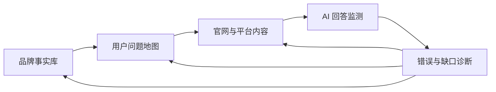
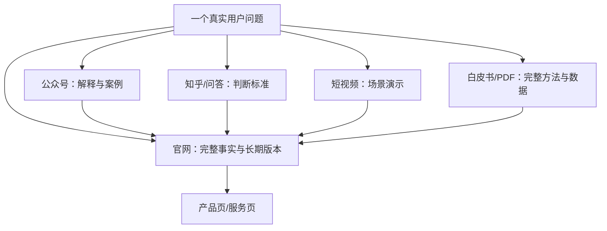

# 国内 GEO 执行手册：从信源建设到持续复测

> 本手册不是对任何单一作者教程的照搬，而是基于公开文章重新整理出的执行框架。原始文章入口统一保存在 [国内 GEO 原文与信源索引](../references/DOMESTIC-GEO-SOURCES.md)。

## 一句话理解

国内 GEO 不是“多发几篇带 AI 关键词的文章”，而是把企业事实、用户问题、平台内容和监测反馈组织成一个可持续闭环。



## 四层执行框架

### 第一层：事实底座

先解决“AI 说的是不是你”。

必须统一：

- 企业法定名称、品牌名和常用简称；
- 产品型号、服务名称和适用范围；
- 公司成立时间、所在城市、联系方式；
- 资质、认证、奖项和数据来源；
- 典型案例、服务流程和限制条件；
- 已停产型号、旧价格和历史信息。

输出物：

```text
brand-facts.yaml
product-catalog.csv
claims-and-sources.csv
change-log.md
```

判断标准：同一事实至少能追溯到一个企业自有来源；重要事实最好存在权威第三方佐证。

### 第二层：问题与内容地图

把传统关键词表升级成用户问题表。

| 问题类型 | 用户示例 | 推荐内容 |
|---|---|---|
| 认知 | GEO 是什么？ | 定义页、入门指南 |
| 需求 | 什么企业适合做 GEO？ | 适用条件、诊断清单 |
| 对比 | A 和 B 怎么选？ | 客观对比、选择标准 |
| 风险 | GEO 有什么坑？ | 避坑指南、边界说明 |
| 决策 | 哪家公司靠谱？ | 服务流程、案例、证据 |
| 本地 | 北京有哪些服务商？ | 真实门店、团队和本地案例 |

每个问题都必须绑定：

- 用户阶段；
- 对应产品或服务；
- 最合适的平台；
- 可验证的事实；
- 转化动作；
- 复测问题。

### 第三层：多平台分工

不同平台不应该机械复制同一篇文章。



推荐分工：

| 平台 | 主要任务 | 不建议 |
|---|---|---|
| 官网 | 品牌事实、产品参数、案例、更新日志 | 只写口号和新闻稿 |
| 公众号 | 系统解释、连续专题、项目复盘 | 每篇只换标题 |
| 知乎/问答 | 回答具体问题、建立选择标准 | 伪装用户软广 |
| 百家号/头条 | 搜索覆盖与摘要分发 | 批量低质量改写 |
| 短视频 | 演示、人物观点、复杂概念可视化 | 只有品牌宣传片 |
| PDF/白皮书 | 长期方法、调研数据、可下载资产 | 没有来源的行业数据 |

### 第四层：监测与纠错

必须区分四个结果：

1. **提及**：回答里出现品牌名；
2. **引用**：回答给出企业官网或页面；
3. **推荐**：品牌进入候选方案或排名；
4. **准确**：企业、产品和参数描述正确。

建议最小监测表：

| 日期 | 平台 | 问题 | 品牌提及 | 官网引用 | 推荐位置 | 描述准确 | 原始回答 |
|---|---|---|---:|---:|---:|---:|---|
|  |  |  |  |  |  |  |  |

同一问题应重复运行并记录：

- 新会话还是连续会话；
- 是否登录；
- 地区、语言和设备；
- 运行时间；
- 回答中的来源 URL；
- 参数错误和旧信息。

## 30 天落地计划

### 第 1 周：建立基线

- [ ] 整理 30–50 个用户问题；
- [ ] 选择 3–5 个 AI 平台；
- [ ] 每题运行至少 3 次；
- [ ] 保存完整回答和引用；
- [ ] 标记错误事实与缺失问题。

### 第 2 周：搭建事实库

- [ ] 统一企业和品牌名称；
- [ ] 整理产品、服务、资质和案例；
- [ ] 为每条关键声明绑定来源；
- [ ] 标记过期和争议内容；
- [ ] 建立版本更新日志。

### 第 3 周：改造 5 个核心页面

优先顺序：

1. 首页定位；
2. 核心产品或服务页；
3. 案例页；
4. FAQ / 避坑页；
5. 对比或选型指南。

每页至少包含：

- 一句话直接答案；
- 适合谁、不适合谁；
- 判断标准；
- 数据或证据来源；
- 更新时间；
- 相关产品和案例入口。

### 第 4 周：复测与复盘

- [ ] 重跑原问题集；
- [ ] 比较提及、引用、推荐和准确率；
- [ ] 检查是否引用了错误页面；
- [ ] 记录新增访问、品牌词和询盘；
- [ ] 输出失败原因，不只展示成功截图。

## 常见问题诊断

### AI 不提品牌

检查：

- 问题是否真的覆盖品牌业务；
- 品牌事实是否清楚；
- 是否只有官网自述，没有第三方信息；
- 内容是否解决用户问题，而非只宣传企业；
- 查询是否过宽，品牌本身缺乏竞争力。

### AI 提品牌但不引用官网

检查：

- 官网是否能抓取和索引；
- 关键事实是否只存在第三方页面；
- 官网页面标题是否模糊；
- 页面正文是否缺少直接答案；
- 第三方内容是否比官网更新、更完整。

### AI 引用错页面

执行：

- 为页面增加明确标题和摘要；
- 修正 Canonical 与内部链接；
- 合并重复页面；
- 在正确页面补完整事实；
- 更新 Sitemap 与页面更新时间；
- 持续复测，而不是期待立即变化。

### AI 描述错误

建立“事实澄清块”：

```markdown
## 事实更新

- 当前产品型号：XXX
- 已停产型号：YYY
- 当前服务范围：ZZZ
- 生效日期：2026-07-17
- 官方来源：链接
```

同步更新官网、公众号、资料页和高权重第三方页面。

## 内容资产优先级

建议按商业价值排序：

1. 产品和服务事实页；
2. 客户真实问题 FAQ；
3. 选型与对比指南；
4. 案例合集；
5. 避坑与风险指南；
6. 行业白皮书；
7. 培训课件和短视频；
8. 本地页面。

本地页面必须有真实差异：团队、地址、客户、政策、服务范围或案例。只替换城市名称的批量模板，不应被视为高质量 GEO 实践。

## 项目角色

| 角色 | 责任 |
|---|---|
| 负责人 | 明确目标、口径和边界 |
| 销售 | 提供真实客户问题和转化反馈 |
| 客服 | 提供顾虑、投诉和 FAQ |
| 内容 | 写作、采访和案例整理 |
| 技术 | 抓取、结构、性能、数据导出 |
| 设计 | 图表、流程图和内容可读性 |
| 数据 | 基线、监测、归因和复盘 |

## 证据纪律

不要写：

- “AI 一定会推荐”；
- “发布后 7 天见效”；
- “引用率提升 300%”但没有样本量；
- “带来 100 单”但没有归因链；
- “平台偏爱这种结构”但没有实验。

应该写：

- 测试平台、问题集和日期；
- 修改前后的原始回答；
- 运行次数与波动；
- 可验证的数据来源；
- 其他可能解释；
- 结论适用范围。

## 延伸阅读

- [国内 GEO 原文与信源索引](../references/DOMESTIC-GEO-SOURCES.md)
- [证据与案例评级标准](../EVIDENCE-STANDARD.md)
- [第三方运营案例索引](../cases/third-party-operations/CASE-INDEX.md)