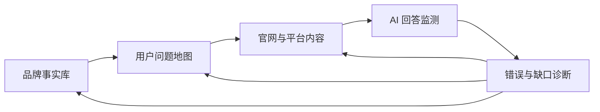
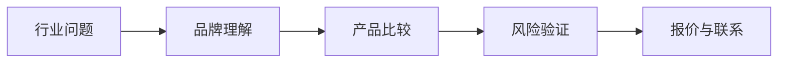
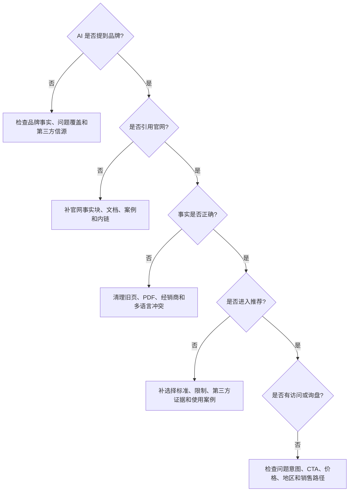

# 国内 GEO 执行手册：从信源建设到持续复测

> 本手册不是对任何单一作者教程的照搬，而是基于公开文章重新整理出的执行框架。原始文章入口统一保存在 [国内 GEO 原文与信源索引](../references/DOMESTIC-GEO-SOURCES.md)。

最后更新：2026-07-20

## 一句话理解

国内 GEO 不是“多发几篇带 AI 关键词的文章”，而是把企业事实、用户问题、官网和平台内容、第三方信源与监测反馈组织成一个可持续闭环。



## 适用对象

- 面向中国市场的企业；
- 主要关注豆包、DeepSeek、腾讯元宝、百度 AI 搜索等平台；
- 已有官网、公众号、百家号、知乎、视频号或行业媒体资产；
- 希望 AI 正确描述品牌、产品和服务；
- 需要把内容运营、技术、销售和监测连接起来。

## 不适用情况

- 企业定位、产品和价格仍频繁变化；
- 品牌事实内部尚未统一；
- 没有任何可以公开的产品资料、案例和服务说明；
- 只想通过批量发文快速“占位”；
- 希望服务商承诺某个平台必定推荐；
- 无法提供修改前基线和后续复测。

---

# 第一部分：四层执行框架

## 第一层：事实底座

先解决“AI 说的是不是你”。

### 1. 建立品牌事实库

至少包含：

```text
企业主体
品牌名称与别名
主营业务与目标客户
产品和服务
型号与参数
认证和资质
服务地区
价格逻辑
交付和售后
案例与证据
官方联系方式
更新时间和负责人
```

推荐做法：

- [TP-006：品牌事实库怎么搭建](../cases/third-party-operations/cases/TP-006-lijinlong-brand-fact-base/README.md)
- 后续将发布 `templates/brand-facts.yaml` 和 `claims-and-sources.csv`。

### 2. 每条事实绑定来源

| 事实 | 官方来源 | 第三方来源 | 状态 | 生效日期 | 负责人 |
|---|---|---|---|---|---|
| 公司标准名称 | About 页面 | 工商信息 | verified | 2020-01-01 | 法务 |
| 某产品精度 | 产品页 / 报告 | 检测机构 | verified | 2026-06-01 | 产品 |
| 服务 500+ 客户 | 案例合集 | 无 | claimed | 2026-01-01 | 销售 |
| 某旧型号在售 | 旧 PDF | 经销商 | expired | 2024-01-01 | 产品 |

### 3. 处理冲突

常见冲突：

- 法定名称、品牌名和公众号名称不一致；
- 官网和销售 PDF 参数不同；
- 经销商仍展示旧型号；
- 百科、百家号和公众号成立年份不同；
- 服务地区和联系方式已经变化；
- 案例结果没有统一时间范围。

处理原则：

```text
确认权威来源
→ 确定当前有效值
→ 标记旧值和失效时间
→ 更新官网与官方账号
→ 通知经销商和合作方
→ 运行 AI 事实问题复测
```

### 4. 事实澄清块

发生错误信息时，官网可以增加简短、可定位的澄清块：

```markdown
## 关于 XX 型号状态的说明

- 当前型号：XX-200
- 旧型号：XX-100，已于 2025 年 12 月停止销售
- 主要变化：……
- 当前产品页：……
- 最后更新：2026-07-20
```

这不是保证 AI 马上更新，而是为搜索和引用提供更明确的新事实。

---

## 第二层：用户问题地图

从“关键词库”升级为“用户问题 + 决策阶段 + 证据需求”。

### 1. 问题来源

优先收集：

- 销售历史询盘；
- 客服和售后记录；
- 官网搜索词；
- 搜索控制台数据；
- 公众号留言；
- 知乎、贴吧、Reddit、行业论坛；
- 电商和地图评论；
- 竞品 FAQ；
- 展会和招投标问题；
- AI 平台当前回答中的信息缺口。

### 2. 问题分类

| 阶段 | 用户问题 | 应提供的内容 |
|---|---|---|
| 认知 | X 是什么？有哪些方案？ | 行业解释、品类指南 |
| 了解品牌 | X 公司是做什么的？ | 品牌事实、官方简介 |
| 比较 | X 和 Y 有什么区别？ | 选择标准、对比表、限制 |
| 风险 | 容易踩什么坑？ | 避坑指南、故障与风险 |
| 决策 | 价格、认证、交付如何？ | 参数、认证、报价逻辑、售后 |
| 交易 | 哪里购买或联系？ | 官方入口、门店、报价和服务范围 |

### 3. 问题优先级

```text
业务价值 × 真实频率 × 内容缺口 × 事实可验证性
```

不要先做 100 个低价值长尾问题。第一轮建议：

- 5 个品牌身份问题；
- 5 个品类问题；
- 5 个比较问题；
- 5 个风险问题；
- 5 个交易问题。

配套：[30 条中英文基线问题](../templates/baseline-query-set.csv)

### 4. 问题与销售漏斗结合



如果内容只覆盖行业科普，可能获得提及或引用，但未必产生询盘。接近决策的问题需要对应：

- 产品页；
- 选型指南；
- 案例；
- 认证；
- 交付；
- 售后；
- 报价入口。

---

## 第三层：官网与多平台内容

不同平台承担不同职责，不建议把同一篇新闻稿复制到所有平台。

### 1. 官网：当前事实和完整证据

官网优先承载：

- 当前品牌事实；
- 产品和服务；
- 参数和认证；
- 官方案例；
- 技术文档；
- FAQ；
- 变更记录；
- 官方联系方式。

推荐阅读：[TP-005：AI 友好官网结构](../cases/third-party-operations/cases/TP-005-laoqian-ai-friendly-website/README.md)

### 2. 公众号：持续解释和微信生态资产

适合：

- 品牌更新；
- 行业解释；
- 案例摘要；
- 使用教程；
- 选型和避坑；
- 活动、门店和服务变化；
- 视频号和小程序入口。

注意：公众号发布本身不等于元宝一定引用。仍需要测试文章是否可发现、是否与问题相关，以及引用的是哪一页。

### 3. 百家号和百度生态：品牌与问题补充

适合：

- 与官网一致的品牌和产品事实；
- 搜索型问题解释；
- 行业专题；
- 官方更新摘要；
- 合理链接官网资料页。

不要：

- 批量替换城市名发布近似文章；
- 复制大量官网正文；
- 用夸张标题替代可验证信息；
- 把百科和百家号当作可以买到的“权威认证”。

### 4. 知乎和社区：真实问题与边界

适合：

- 专业问答；
- 选择标准；
- 失败和限制；
- 行业经验；
- 产品不适用场景；
- 对争议问题进行透明解释。

应披露品牌、员工、供应商或商业关系，避免伪装消费者。

### 5. 视频号和短视频：演示与场景证据

适合：

- 产品实际操作；
- 安装与维护；
- 参数测试；
- 客户授权案例；
- 工厂、门店或团队；
- 常见问题演示。

视频标题、简介和口播应与官网事实一致，并在必要时指向完整文档。

### 6. 行业媒体和第三方目录：独立佐证

适合提供：

- 企业和产品背景；
- 行业采访；
- 标准和认证；
- 公开测试；
- 展会、奖项和项目；
- 独立评测。

第三方来源价值在于独立性，不应该通过虚构媒体或付费软文伪装自然报道。

### 平台职责表

| 平台 | 首要职责 | 不应承担的职责 |
|---|---|---|
| 官网 | 当前事实和完整资料 | 伪装第三方评价 |
| 公众号 | 持续解释和微信生态连接 | 取代官网唯一事实源 |
| 百家号 | 百度生态问题覆盖 | 大量城市模板页 |
| 知乎 | 专业问题和选择标准 | 隐藏商业关系 |
| 视频号 | 场景演示和操作证据 | 只做空泛广告 |
| 行业媒体 | 独立报道和第三方证据 | 复制品牌营销口号 |
| 地图与本地目录 | 门店、地址、营业和服务范围 | 发布与实体无关的地域页 |

---

## 第四层：AI 回答监测和纠错

### 1. 建立基线

使用：

- [AI 可见性基线测试](ai-visibility-baseline.md)
- [每周 GEO 监测表](../templates/weekly-monitoring.csv)
- [指标解释](../explainers/mentions-vs-citations.md)

至少区分：

```text
品牌提及
官网引用
第三方引用
明确推荐
事实准确性
负面描述
访问与询盘
```

### 2. 最小六指标看板

| 指标 | 说明 |
|---|---|
| 提及率 | AI 回答中是否出现品牌 |
| 官网引用率 | 是否引用官方页面 |
| 推荐率 | 是否明确建议考虑品牌 |
| 事实准确率 | 品牌和参数是否正确 |
| 负面提及率 | 是否出现负面或风险描述 |
| 来源分布 | 官网、媒体、社区、经销商各占多少 |

商业指标单独看：

- AI referral；
- 品牌搜索；
- 直接访问；
- 询盘；
- 报价；
- 订单；
- 无法归因的增长。

### 3. 诊断树



### 4. 常见故障与处理

#### AI 不提品牌

检查：

- 品牌是否过于新或名称歧义；
- 官网是否清楚说明做什么；
- 目标问题是否被内容覆盖；
- 是否只有自我宣传，缺少第三方来源；
- 竞品在哪些来源中出现。

#### AI 只提竞品

拆解：

- 竞品被哪些来源支持；
- 推荐理由是什么；
- 竞品是否有更清晰的参数、评测和案例；
- 你的差异化是否可以验证；
- 问题是否适合你的产品。

不要通过攻击竞品解决，应建立公开选择标准。

#### AI 只引用第三方，不引用官网

可能原因：

- 官网信息不够具体；
- 页面只有营销口号；
- 第三方文章更直接回答问题；
- 官网结构或标题难以定位；
- 官网事实冲突；
- 官方文档不是公开可访问页面。

#### AI 引用错页面

处理：

- 明确页面标题和主问题；
- 增加当前版本和更新时间；
- 设置合理 canonical 和跳转；
- 清理重复内容；
- 从旧页链接新页；
- 更新站内导航和 Sitemap；
- 修正外部重要页面。

#### AI 说错企业或产品

优先级最高：

- 建立事实澄清块；
- 修正官网、PDF 和多语言页面；
- 标记停产型号；
- 联系重要经销商更新；
- 发布官方变更说明；
- 用固定事实问题持续复测。

---

# 第二部分：30 天实施计划

## 第 1 周：事实和基线

### Day 1：确定范围

- [ ] 选择 1 个品牌、1 个品类、1–3 个产品；
- [ ] 明确国家、语言和目标平台；
- [ ] 确定目标：提及、引用、准确性、推荐或询盘。

### Day 2–3：建立事实库

- [ ] 统一公司、品牌和产品名称；
- [ ] 收集参数、认证、服务地区和售后；
- [ ] 标记 verified、claimed、expired 和 disputed；
- [ ] 找出官网、公众号、PDF 和经销商冲突。

### Day 4：建立问题地图

- [ ] 从销售、客服和搜索数据收集问题；
- [ ] 选择 20–30 个高价值问题；
- [ ] 标记漏斗阶段和需要核验的事实。

### Day 5–7：运行基线

- [ ] 至少测试 2 个平台；
- [ ] 每题至少运行 3 次；
- [ ] 保存完整回答和引用；
- [ ] 输出前三大问题。

## 第 2 周：改造核心页面

只改有限变量：

1. 首页定位；
2. 一个核心产品页；
3. 一个代表案例；
4. 一个 FAQ；
5. 一个选型或避坑指南。

每页补充：

- 直接答案；
- 更新时间；
- 数据来源；
- 适合和不适合场景；
- 参数解释；
- 限制条件；
- 相关案例；
- 下一步动作。

## 第 3 周：平台分发与第三方信源

- [ ] 公众号发布 2–3 篇与真实问题相关的内容；
- [ ] 百家号或知乎补充不同角度，不复制全文；
- [ ] 制作一个视频演示或操作内容；
- [ ] 更新重要行业目录和门店信息；
- [ ] 联系已有媒体、客户和经销商修正旧事实；
- [ ] 记录每项内容对应的问题和页面。

## 第 4 周：复测和复盘

- [ ] 使用原问题集复测；
- [ ] 保持平台、地区、语言和账号状态尽量一致；
- [ ] 比较提及、引用、推荐和准确性；
- [ ] 检查新出现的错误；
- [ ] 单独统计访问和询盘；
- [ ] 记录失败动作；
- [ ] 制定下一轮只修改 1–3 个变量。

---

# 第三部分：团队分工

## 推荐 RACI

| 工作 | 负责人 | 参与者 | 审核者 |
|---|---|---|---|
| 品牌事实库 | 品牌 / 产品 | 销售、技术 | 法务 / 管理层 |
| 问题地图 | 内容 / 增长 | 销售、客服 | 业务负责人 |
| 官网改造 | 内容 / 产品 | 设计、开发 | 品牌、法务 |
| 平台内容 | 内容运营 | 专家、销售 | 品牌、合规 |
| 数据监测 | 分析 / 增长 | 内容、技术 | 项目负责人 |
| 询盘归因 | 销售运营 | 市场、CRM | 销售负责人 |
| 错误纠正 | 品牌事实负责人 | 产品、技术 | 法务 / 合规 |

## 项目启动会必须确认

- 目标品牌、产品和市场；
- 不做哪些平台和场景；
- 当前事实口径；
- 什么算提及、引用、推荐和成功；
- 谁可以批准对外声明；
- 谁保存测试数据；
- 谁负责销售和订单归因；
- 哪些信息不能公开。

---

# 第四部分：内容资产体系

## 行业白皮书

应该包含：

- 问题定义；
- 数据和来源；
- 方法论；
- 适用条件；
- 限制；
- 案例；
- 更新记录。

不要把销售册改名为白皮书。

## 案例合集

单篇案例解决“这一次发生了什么”，案例合集解决：

- 哪些场景反复出现；
- 哪些方法稳定；
- 哪些行业差异大；
- 哪些结果无法复现；
- 哪些指标具有商业价值。

案例合集应有证据矩阵，而不是只堆 Logo 和增长数字。

## 选型指南

建议结构：

```text
用户场景
→ 必须满足的条件
→ 关键选择标准
→ 各方案优缺点
→ 不适合的情况
→ 验证方法
→ 下一步
```

对比竞品时避免：

- 虚假参数；
- 未注明日期的价格；
- 选择性忽略缺点；
- 攻击性描述；
- 将自家结论伪装成第三方评测。

## 避坑指南

风险型内容的价值来自透明度，而不是制造恐惧。应说明：

- 什么情况下会失败；
- 风险发生概率或条件；
- 如何检查；
- 如何避免；
- 出现问题后如何解决；
- 自家方案也有哪些限制。

---

# 第五部分：本地 GEO

适用于门店、本地服务、医院、学校、维修、装修、企业服务网点等。

## 本地事实底座

- 标准名称；
- 地址；
- 电话；
- 营业时间；
- 服务范围；
- 门店和总部关系；
- 资质；
- 停车、交通和预约；
- 当前状态；
- 地图和本地目录入口。

## 地域信源

- 官网门店页；
- 地图平台；
- 政府或行业目录；
- 本地媒体；
- 真实客户评价；
- 本地活动和案例；
- 公众号和视频号地域内容。

## 不建议

- 为每个城市生成只有城市名不同的页面；
- 没有真实服务能力却覆盖大量地区；
- 虚构门店、地址和评价；
- 地址、电话和营业时间在不同平台冲突；
- 通过标题堆砌“最佳、第一、权威”。

---

# 第六部分：服务商选择与验收

## 询问服务商

1. 基线问题集是什么？
2. 测试哪些平台、地区和账号状态？
3. 每个问题运行几次？
4. 如何区分提及、引用、推荐和准确性？
5. 是否保存原始回答？
6. 内容发布在哪里，版权归谁？
7. 是否伪装用户参与社区？
8. 如何处理错误参数和负面信息？
9. 访问、询盘和订单如何归因？
10. 平台波动或结果下降时如何解释？

## 风险承诺

警惕：

- 保证 7 天被所有 AI 推荐；
- 保证固定排名；
- 保证每个平台答案一致；
- 只展示有利截图；
- 不说明问题集和运行次数；
- 以发文数量作为唯一交付；
- 通过大量城市页、问答和社区账号制造信号；
- 将传统 SEO 流量全部归为 GEO；
- 不允许客户查看原始数据。

## 验收应看

- 品牌事实冲突是否减少；
- 高价值问题覆盖是否增加；
- 官网和第三方引用来源是否改善；
- 事实准确率是否提升；
- 错误和旧信息是否被处理；
- 是否建立持续监测机制；
- 是否产生可确认访问和询盘；
- 是否公开失败结果和限制。

---

# 第七部分：月度复盘模板

## 1. 本月做了什么

- 更新事实；
- 修改页面；
- 发布内容；
- 修正外部信源；
- 运行平台和问题数量。

## 2. 问题覆盖

| 问题类型 | 总数 | 已覆盖 | 待覆盖 |
|---|---:|---:|---:|
| 品牌身份 |  |  |  |
| 品类推荐 |  |  |  |
| 产品对比 |  |  |  |
| 风险售后 |  |  |  |
| 交易本地 |  |  |  |

## 3. 平台结果

| 平台 | 提及率 | 官网引用率 | 推荐率 | 准确率 | 主要问题 |
|---|---:|---:|---:|---:|---|
| 豆包 |  |  |  |  |  |
| DeepSeek |  |  |  |  |  |
| 元宝 |  |  |  |  |  |
| 百度 AI 搜索 |  |  |  |  |  |

## 4. 来源变化

- 新增被引用页面；
- 消失的来源；
- 旧页面和错误来源；
- 第三方信源变化；
- 竞争对手主要来源。

## 5. 商业结果

- AI referral；
- 品牌搜索；
- 直接访问；
- 询盘；
- 报价；
- 订单；
- 无法归因部分。

## 6. 失败和限制

- 哪些内容没有被发现；
- 哪些修改没有产生变化；
- 哪些错误仍存在；
- 哪些数据不能确认；
- 平台是否发生更新。

## 7. 下月只做什么

限制为 3–5 项，确保可以判断增量效果。

---

# 最终执行清单

## 事实

- [ ] 品牌和产品名称统一
- [ ] 参数、认证、价格和服务有来源
- [ ] 旧型号和旧政策已标记
- [ ] 每条重要事实有负责人和更新时间

## 问题

- [ ] 至少 20 个真实问题
- [ ] 覆盖品牌、品类、对比、风险和交易
- [ ] 标记业务价值和漏斗阶段
- [ ] 加入竞品和本地问题

## 内容

- [ ] 官网 5 个核心页面完成改造
- [ ] 公众号和外部平台承担不同职责
- [ ] 有选择标准、限制和失败情况
- [ ] 有真实案例和证据
- [ ] 没有批量城市替换页和伪装口碑

## 监测

- [ ] 修改前已建立基线
- [ ] 记录平台、地区、语言和账号状态
- [ ] 保存原始回答和引用
- [ ] 区分提及、引用、推荐和准确性
- [ ] 每周运行核心问题
- [ ] 每月完整复盘

## 商业

- [ ] 官网有清晰 CTA
- [ ] GA4、CRM 和销售记录来源
- [ ] AI 访问、品牌搜索和询盘分开统计
- [ ] 订单不做过度归因
- [ ] 公开失败和未知数据

## 结论

国内 GEO 的核心不是“多平台铺量”，而是：

```text
让企业事实更准确
让用户问题被完整回答
让公开内容更容易核验
让平台结果可以重复测量
让商业效果不过度归因
```

从 [AI 可见性基线测试](ai-visibility-baseline.md) 开始，再根据问题进入事实库、官网改造、多平台内容和纠错流程。