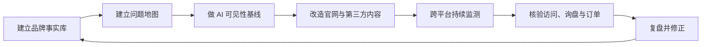

# GEO 执行 Playbook

> 把案例中的有效动作整理成可以直接执行的流程、清单和表格。

## 推荐执行顺序

## 已发布

### [国内 GEO 执行手册](DOMESTIC-GEO-PLAYBOOK.md)

适合需要覆盖豆包、DeepSeek、元宝、百度 AI 搜索和微信生态的团队。包含事实底座、问题地图、多平台分工、监测和 30 天执行计划。

### [AI 可见性基线测试](ai-visibility-baseline.md)

适合第一次回答以下问题：

- AI 是否认识我的品牌？
- 哪些问题会提到我？
- 提到我时引用的是官网还是第三方？
- 推荐位置和产品参数是否正确？
- 竞争对手在哪些问题中更强？

配套文件：

- [`templates/baseline-query-set.csv`](../templates/baseline-query-set.csv)
- [`templates/weekly-monitoring.csv`](../templates/weekly-monitoring.csv)

## 计划发布

| Playbook | 解决的问题 | 状态 |
|---|---|---|
| 品牌事实库 | AI 对品牌名称、定位和参数描述不一致 | TP-006 已提供初版 |
| Reddit 社区参与 | 如何真实参与，而不是伪装用户刷口碑 | 规划中 |
| 官网内容改造 | 如何把营销页面改成可验证的信息页面 | TP-005 已提供初版 |
| 产品对比页 | 如何建立选择标准并避免贬低竞品 | 规划中 |
| AI 引用纠错 | AI 仍引用旧型号、旧价格和错误参数 | 规划中 |
| GEO 商业归因 | 如何区分 AI、SEO、广告和销售贡献 | 规划中 |
| 负面语料治理 | 如何处理真实投诉和过时负面信息 | 规划中 |

## 每个 Playbook 必须包含

1. 适用条件；
2. 不适用条件；
3. 输入材料；
4. 人员与时间；
5. 分步骤执行；
6. 产出文件；
7. 指标和成功标准；
8. 失败模式；
9. 合规风险；
10. 可复现实验。

## 不建议的执行方式

- 不建立基线就直接宣布增长；
- 只展示一次有利的 AI 回答；
- 把品牌提及等同于官网引用；
- 把官网引用等同于询盘或订单；
- 批量发布近似文章覆盖城市和关键词；
- 伪装消费者发布品牌推荐；
- 用无法核验的流量或订单截图作为唯一证据。

从 [AI 可见性基线测试](ai-visibility-baseline.md) 开始，通常是风险最低、最容易复现的第一步。