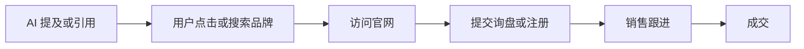

# AI 可见性基线测试 Playbook

> 在修改网站、发布内容或参与社区之前，先建立一份可重复的基线。否则后续出现任何变化，都很难判断是优化效果、平台波动还是偶然结果。

## 适用场景

- 品牌第一次系统开展 GEO；
- 想比较 ChatGPT、Perplexity、Gemini、豆包、DeepSeek、元宝等平台；
- 想判断品牌是否被提及、官网是否被引用；
- 准备修改官网、FAQ、产品页或第三方内容；
- 服务商声称效果提升，需要建立验收口径；
- 需要持续观察竞品 AI 可见性。

## 不适用场景

- 只想验证某一次截图是否真实；
- 没有明确品牌、产品、市场或目标用户；
- 产品事实和官网信息仍严重冲突；
- 期待通过一次测试预测全部用户看到的答案；
- 无法保存测试日期、地区、语言和平台环境。

## 配套文件

- [基线问题集 CSV](../templates/baseline-query-set.csv)
- [每周监测表 CSV](../templates/weekly-monitoring.csv)

## 一、确定测试对象

建立测试卡：

```yaml
brand: "[BRAND]"
category: "[CATEGORY]"
products:
  - "[PRODUCT A]"
  - "[PRODUCT B]"
markets:
  - country: "US"
    language: "en"
  - country: "CN"
    language: "zh"
competitors:
  - "[COMPETITOR A]"
  - "[COMPETITOR B]"
primary_goal: "brand_mention | official_citation | recommendation | accuracy | leads"
```

一个基线不要同时覆盖过多国家、语言和产品。第一轮建议：

- 1 个品牌；
- 1 个主要品类；
- 1–3 个产品；
- 2 个竞争对手；
- 1–2 个市场；
- 20–50 个问题。

## 二、构建问题集

问题至少覆盖五类意图：

| 类型 | 示例 | 作用 |
|---|---|---|
| 品牌身份 | `[BRAND] 是做什么的？` | 判断 AI 是否认识品牌 |
| 品类推荐 | `适合商务旅行的移动电源品牌有哪些？` | 判断是否进入候选集合 |
| 产品对比 | `[PRODUCT] 和 [COMPETITOR] 有什么区别？` | 检查选择标准和参数 |
| 风险与售后 | `[BRAND] 有哪些缺点？售后怎么样？` | 检查负面语料和完整性 |
| 交易问题 | `在哪里购买或申请报价？` | 检查商业路径和官方入口 |

不要只测试品牌词。用户通常会先问品类、问题、场景和选择标准，而不是直接输入一个陌生品牌。

### 问题优先级

```text
业务价值 × 用户真实频率 × 当前内容缺口 × 可验证性
```

优先保留：

- 销售经常收到的问题；
- 客服和售后高频问题；
- Reddit、知乎、行业论坛和评论区中的真实问题；
- 搜索控制台已有曝光的问题；
- 竞争对手经常被推荐的问题；
- 接近选型、报价和采购决策的问题。

## 三、固定测试环境

每次运行至少记录：

- 日期和时间；
- 时区；
- 平台和模式；
- 登录或未登录；
- 新会话或多轮会话；
- 国家、城市和语言；
- 完整问题；
- 原始回答；
- 引用 URL；
- 测试人员。

### 为什么要记录环境

同一问题可能因以下因素产生不同答案：

- 平台更新；
- 搜索索引变化；
- 地区和语言；
- 登录状态；
- 用户历史和个性化；
- 新对话或已有上下文；
- 生成随机性；
- 来源网页更新。

因此，单次截图只能证明“某次运行出现过”，不能证明所有用户都会看到。

## 四、运行次数

### 最低方案

- 每个问题每个平台运行 3 次；
- 使用新对话；
- 在同一周内完成；
- 保持国家、语言和账号状态一致。

### 推荐方案

- 每个问题每个平台运行 5 次；
- 分 2–3 天运行；
- 登录与未登录分组；
- 国内和海外市场分组；
- 新会话和多轮会话分组。

举例：

```text
30 个问题 × 3 个平台 × 5 次 = 450 次回答
```

工作量较大时，可以先选择 10 个高优先级问题建立最小基线，再逐步扩展。

## 五、记录四个核心结果

### 1. Brand Mention：品牌提及

答案中是否出现品牌名称或明确别名。

```text
提及率 = 提到品牌的回答次数 ÷ 总运行次数
```

注意：提到品牌不代表评价正面，也不代表引用官网。

### 2. Official Citation：官网引用

答案是否把品牌官网、官方文档或官方帮助页作为来源。

```text
官网引用率 = 引用官方来源的回答次数 ÷ 总运行次数
```

同一回答可能提到品牌，却只引用媒体、论坛或经销商。

### 3. Recommendation：明确推荐

品牌是否进入“建议选择”“最佳产品”“优先考虑”等推荐集合。

记录：

- 是否推荐；
- 推荐位置；
- 推荐理由；
- 是否附带限制；
- 是否与用户场景匹配。

### 4. Fact Accuracy：事实准确性

检查：

- 品牌定位；
- 产品型号；
- 参数和单位；
- 认证；
- 价格；
- 服务范围；
- 质保；
- 发布时间；
- 官方联系方式。

建议状态：

```text
accurate   关键事实正确
partial    部分正确或缺失
incorrect  存在明确错误
unknown    无法判断
```

## 六、增加竞争对手对照

对每个高价值问题，同时记录：

- 哪些竞品被提及；
- 排名或出现位置；
- 引用了哪些来源；
- 推荐理由；
- 竞品拥有哪些证据类型；
- 你的品牌缺失什么。

不要简单复制竞品文章。先判断竞品优势来自：

- 更明确的产品事实；
- 第三方评测；
- 行业媒体；
- 用户社区；
- 公开测试数据；
- 更完整的售后信息；
- 更强的地域信号；
- 更清晰的页面结构。

## 七、计算基线指标

建议至少输出：

| 指标 | 计算方式 |
|---|---|
| 品牌提及率 | 提及品牌的运行次数 / 总运行次数 |
| 官网引用率 | 引用官方来源的运行次数 / 总运行次数 |
| 推荐率 | 明确推荐品牌的运行次数 / 总运行次数 |
| Top 3 推荐率 | 品牌位于前三的运行次数 / 总运行次数 |
| 事实准确率 | 关键事实准确的运行次数 / 可判断次数 |
| 负面提及率 | 明确负面描述的运行次数 / 总运行次数 |
| 回答稳定性 | 多次运行中核心结论一致的比例 |
| 来源集中度 | 最常见引用域名占全部引用的比例 |

### 不建议直接合成一个总分

总分容易掩盖问题。例如：

- 提及率高，但全部是负面内容；
- 推荐率高，但产品参数错误；
- 官网引用率高，但没有品牌名称；
- 品牌曝光增加，但没有任何访问或询盘。

第一阶段先保留分项指标。

## 八、形成问题矩阵

| 问题 | 提及率 | 官网引用率 | 推荐率 | 准确率 | 首要缺口 |
|---|---:|---:|---:|---:|---|
| 品牌是什么 | 80% | 20% | 不适用 | 60% | 品牌定位不统一 |
| 最佳产品推荐 | 10% | 0% | 5% | 100% | 缺少第三方证据 |
| 产品对比 | 30% | 10% | 15% | 50% | 参数和型号冲突 |
| 售后怎么样 | 20% | 0% | 不适用 | 40% | 官网售后信息不足 |

然后将问题分成四类：

1. **AI 不认识品牌**：先修事实底座和实体一致性；
2. **认识但不引用官网**：补可验证事实、文档和页面结构；
3. **引用但不推荐**：补选择标准、案例和第三方证据；
4. **推荐但事实错误**：优先修复旧页面、PDF、经销商和多语言冲突。

## 九、建立修改计划

每次实验只修改有限变量，例如：

- 新增一个品牌事实页；
- 重构一个产品页；
- 新增一个选型指南；
- 修正旧 PDF；
- 增加一个公开测试报告；
- 更新经销商和第三方信息；
- 发布一个真实案例。

不要同时修改几十个页面、发布大量外部内容、投放广告和调整价格，否则无法判断哪个动作产生效果。

## 十、复测周期

建议：

- 每周：运行 10 个核心问题；
- 每月：运行全部问题集；
- 重大产品更新后：立即运行事实与版本问题；
- 负面事件后：运行投诉、风险和品牌评价问题；
- 平台重大更新后：重新建立一轮基线。

GEO 结果可能因索引和平台更新存在延迟。复测时记录实际日期，不预设“3 天必生效”或“30 天必提升”。

## 十一、商业结果单独记录

AI 可见性和商业转化之间至少还有以下环节：



商业数据建议分开记录：

- AI referral；
- 品牌词搜索；
- 直接访问；
- 表单询盘；
- 自报来源；
- Demo 或报价；
- 成交订单；
- 无法归因的转化。

不能因为订单增长，就倒推出全部订单来自 GEO。

## 十二、30 分钟最小版本

时间有限时：

1. 从模板选 10 个问题；
2. 选择 2 个平台；
3. 每题运行 1 次，保存原始回答；
4. 记录提及、引用、推荐和准确性；
5. 找出最明显的 3 个缺口；
6. 一周后重复运行。

这不是正式统计基线，但可以快速发现：

- AI 完全不认识品牌；
- 品牌定位错误；
- 官网从未被引用；
- 旧型号持续出现；
- 竞争对手拥有明显的第三方来源优势。

## 完成标准

- [ ] 品牌、品类、产品和市场已明确
- [ ] 至少 20 个真实问题
- [ ] 至少 2 类用户意图
- [ ] 记录平台、地区、语言和账号状态
- [ ] 保存原始回答和引用 URL
- [ ] 区分提及、引用、推荐和准确性
- [ ] 加入至少 2 个竞争对手
- [ ] 输出问题矩阵和前三大缺口
- [ ] 确定下一轮只修改哪些变量
- [ ] 设定复测日期

完成后，再进入官网改造、内容生产和第三方信源建设。